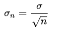
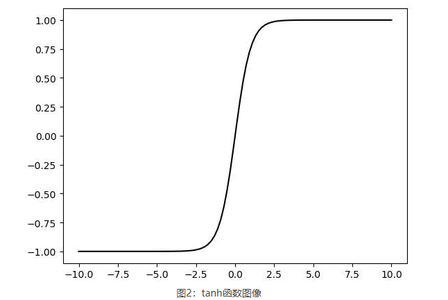

# 数学公式 :chart_with_upwards_trend: 

## 数学符号

### 数字


### 集合


### 运算符(函数)


### 微积分


### 概率


## 排列(Permutation)

排列数公式就是从n个不同元素中，任取m（m≤n）个元素（被取出的元素各不相同），按照一定的顺序排成一列，叫做从n个不同元素中取出m个元素的一个排列。排列与元素的顺序有关。计算公式如下：
$$
\frac{n!}{(n-m)!}
$$

## 组合(Combination )

组合数公式是指从 n 个不同元素中，任取 m(m≤n) 个元素并成一组，叫做从 n 个不同元素中取出 m 个元素的一个组合；从 n 个不同元素中取出 m(m≤n) 个元素的所有组合的个数，叫做 n 个不同元素中取出 m 个元素的组合数。计算公式如下：
$$
\frac{n!}{m!(n-m)!}
$$


## 均值(mean)

均值：针对实验观察到的特征样本，恒定的真实值进行观测狗，将测量偏离真实值的所有值进行平均所得的结果。

1、均值公式：

(1+2+3+4+...+n)/n


如：进行投骰子，投6次，点数分别为：2，2，3，4，4，4，这6次的观察就所得的样本。

均值为：(2+2+2+4+4+4)/6 = 18/6 = 3 

## 期望(expectation)

数学期望(均值或简称期望)是实验中每次可能结果的概率乘以其结果的总和，它反映了随机变量平均取值的大小。

**注意：期望值并不一定等同于尝试中的“期望” -- “期望值”，也许与每一个结果都不相等。期望值是该变量输出值的平均数。期望值并不一定包含变量的输出值集合里**

1、期望

期望是针对于随机变量而言的一个量，可理解为一种站在“上帝视角”的值，对样本空间而言。

2、均值

均值是一个统计量(对观察样本的统计)，而期望是一种概率论概率，是一个数学特征。

3、期望公式

离散型随机变量x的取值为：X1，X2，X3，X4，...Xn。p(X1)，p(X2)，p(X3)，...p(Xn)为X对应取值的概率，可理解为数据X1，X2，X3，X4，...Xn出现的频率f(xi):

则：E(X) = X1\*p(X1)+X2\*p(X2)+X3\*p(X3)+X4\*p(X4)+...Xn\*p(Xn)

​				   = X1\*f(X1)+X2\*f(X2)+X3\*f(X3)，X4\*f(X4)+...Xn\*f(Xn)

如投骰子E(x)期望为：\*2/18 + 2 \* 2/18 + 2 \* 2/18 + 4 \* 4/18  + 4 \* 4 /18 + 4 \* 4/18 = 3.333333

**期望于概率值联系在一起的，如果说概率是频率随像本趋于无穷的极限，期望就是平均数随机样本趋于无穷的极限，可看出均值和期望的联系也是大数定理联系起来的。**

## 方差(variance)

方差是各个数据与期望的差的平方的平均值。方差越小，说明这组数据越稳定，方差越大，代表这组数据越不稳定。

在概率论与数理统计中，方差用来衡量随机变量和其数学期望(即均值)之间的偏离程度。方差是各个数据与平均数之差的平均和的平均数。

1、方差公式

s = (1/n)[(x1-x)^2+(x2-x)^2+(x3-x)^2 (xn-x)^2]

```python
x 表示样本的平均数

n 表示样本的数量

xn 表示个体

s 为方差
```

2、计算方法：

若x1，x2，x3，...xn的平均数为M，则方差公式可表示为：


方差公式


例1 两人的5次测验成绩如下：

X： 50，100，100，60，50 ，平均成绩为E(X )=72；

Y： 73， 70， 75，72，70 ，平均成绩为E(Y )=72。

平均成绩相同，但X 不稳定，对平均值的偏离大。方差描述随机变量对于数学期望的偏离程度。

单个偏离是消除符号影响方差即偏离平方的均值，记为D(X )：

直接计算公式分离散型和连续型，具体为：这里 是一个数。推导另一种计算公式

得到：“方差等于平方的[均值](https://baike.baidu.com/item/均值)减去均值的平方”。

其中，分别为离散型和连续型的计算公式。 称为标准差或均方差，方差描述波动

3、性质

1．设C为常数，则D(C) = 0（常数无波动）；

2． D(CX )=C2D(X ) （常数平方提取，C为常数，X为随机变量）；

证：特别地 D(-X ) = D(X ), D(-2X ) = 4D(X )（方差无负值）

3．若X 、Y 相互独立，则证：记则

前面两项恰为 D(X)和D(Y)，第三项展开后为

当X、Y 相互独立时，

故第三项为零。

特别地

独立前提的逐项求和，可推广到有限项。

方差公式：

平均数： （n表示这组数据个数，x、x、x……x表示这组数据具体数值）


方差公式：


标准差计算公式：标准差σ=方差开平方。

**标准差**

标准差，中文环境中又常称均方差，是离均差平方的算术平均数的平方根，用σ表示。在概率统计中最常使用作为统计分布程度上的测量。标准差是方差的算术平方根。标准差能反映一个数据集的离散程度。平均数相同的两组数据，标准差未必相同;原因是它的大小，不仅取决于标准值的离差程度，还决定于数列平均水平的高低。因而对于具有不同水平的数列或总体，就不宜直接用标准差来比较其标志变动度的大小，而需要将标准差与其相应的平均数对比，计算标准差系数，即采用相对数才能进行比较。

**方差**

方差是数据组中各数值与其均值离差平方的平均数，它能较好地反映出数据的离散程度，是实际中应用最广泛的离散程度测度值。方差越小，说明数据值与均值的平均距离越小，均值的代表性越好。

标准差与方差的联系

标准差与方差计算比较简便，又具有比较好的数学性质，是应用最广泛的统计离散程度的测度方法。但是标准差与方差只适用于数值型数据。此外，与均值一样，它们对极端值也很敏感。

## 标准差(standard deviation)

标准差(standard deviation)是离均差平方的算术平均数(即：方差)的算术平方根。用σ表示。标准差也被称为标准偏差，或者实验标准差，在概率统计中最常使用作为统计分布程度上的测量依据。标准差是方差的算术平方根。

标准差能反映一个数据集的离散程度。平均数相同的两组数据，标准差未必相同

1、计算公式

总体标准差


样本标准差


标准误差



与方差的关系：方差=标准差的平方。

在实验中单次测量总是难免会产生误差，为此我们经常测量多次，然后用测量值的平均值表示测量的量，并用误差条来表征数据的分布，其中误差条的高度为±标准误差。这里即标准差。

变异系数：


其中，


指数据的平均数。

## 协方差(convariance)

在概率论和统计学中用于衡量两个变量的总体误差。方差是协方差的一种特殊情况，即当两个变量是相同的情况。

协方差表示的是两个变量的总体的误差，这与只表示一个变量误差的方差不同。如果两个变量的变化趋势一致，也就是说如果其中一个大于自身的期望值，另外一个也大于自身的期望值，那么两个变量之间的协方差就是正值。如果两个变量的变化趋势相反，即其中一个大于自身的期望值，另外一个却小于自身的期望值，那么两个变量之间的协方差就是负值。 

1、计算公式

协方差公式cov(x, y) = E[(x-E[x])(y-E[y]).E[x]代表变量x的期望


## 矩阵计算

### 标量导数


### 亚导数


### 求导

**1.梯度**

① y是向量，x是标量的话，求导为标量。

② y是向量，x是向量的话，求导为矩阵。


**2.标量对向量进行求导**

③ $x_{1}^{2}+2x_{2}^{2}$是一个椭圆，梯度是指向值变化最大的方向。


**3.向量对标量求导**


**4.向量对向量求导**


**5.矩阵对矩阵求导**


## 函数图像

### 对数函数


### Sigmoid函数

$$
sig(x) = \frac{1}{1+e^{-x}}
$$


###  tanh函数

$$
tanh(x) = \frac{1-e^{-2x}}{1+e^{-2x}}
$$



### ReLU函数

$$
f(x) = \begin{cases}
0 & x<=0 \\
x & x>0 \\
\end{cases}
$$


## 常见名词释义

### 熵（entropty）

泛指某些物质系统状态的一种量度，某些物质系统状态可能出现的程度。熵的概念是由德国物理学家克劳修斯于1865年提出。最初是用来描述“能量退化”的物质状态参数之一，在热力学中有广泛的应用。但那时熵仅仅是一个可以通过热量改变来测定的物理量，其本质仍没有很好的解释，直到统计物理、信息论等一系列科学理论发展，熵的本质才逐渐被解释清楚。即熵的本质是一个系统“内在的混乱程度”。


科学家发现，一个东西放在那，不管它自己怎么运动，只会变得越来越混乱、无序，也就是说，熵只会越来越大，这就叫熵增定律。

### 相对熵（KL散度）

概率论与数理统计中我们学过分布之间的差异计算：KL散度(相对熵)

 相对熵又称互熵，设p(x)和q(x)是取值的两个概率分布，相对熵用来表示两个概率分布的差异，当两个随机分布相同时，它们的相对熵为零，当两个随机分布的差别增大时，它们的相对熵也会增大。：
$$
\begin{aligned} D(p||q) = \sum_{i = 0}^{n}p(x)log(\frac{p(x_{i})}{q(x_{i})}) \\
= \sum_{i = 0}^{n}P(x_{i})(logp(x_{i}) - logq(x_{i}))
\end{aligned}
$$


## L1&L2范数

监督机器学习的核心原理公式：


1、该公式可谓是机器学习中最核心最关键最能概述监督学习的核心思想的公式：

1.所有的有监督机器学习，无非就是正则化参数的同时最小化经验误差函数。

2.最小化经验误差是为了极大程度的拟合训练数据，正则化参数是为了防止过分的拟合训练数据

3.监督机器学习是为了让建立的模型能够发现数据中普遍的一般的规律，这个普遍的一般的规律无论对于训练集还是未知的测试集，都具有较好的拟合性能。

通俗点举例就是，考试能力很强，应用能力很差，或者是模拟考很强，高考却一般。 


2、第一项经验误差函数在机器学习中无疑地位重要，公式的第二项：正则化项。

1.第二项中 λ 为正则化系数，通常是大于 0 的，是一种调整经验误差项和正则化项之间关系的系数。

2.λ = 0 时相当于该公式没有正则化项，模型全力讨好第一项，将经验误差进行最小化，往往这也是最容易发生过拟合的时候。

3.随着 λ 逐渐增大，正则化项在模型选择中的话语权越来越高，对模型的复杂性的惩罚也越来越厉害。

4.所以，在实际的训练过程中，λ 作为一种超参数很大程度上决定了模型生死。 

### L1范数

L0 正则化：L0 正则化也就是 L0 范数，即矩阵中所有非 0 元素的个数。

如何在正则化过程中选择了 L0 范数，那该如何理解这个 L0 呢？

1.L0 范数就是希望要正则化的参数矩阵 W 大多数元素都为 0。如此简单粗暴，让参数矩阵 W 大多数元素为 0 就是实现稀疏而已。

2.在机器学习领域，L0 和 L1 都可以实现矩阵的稀疏性，但在实践中，L1 要比 L0 具备更好的泛化求解特性而广受青睐。

3.**L1 范数就是矩阵中各元素绝对值之和** ，正如前述所言，L1 范数通常用于实现参数矩阵的稀疏性。至于为啥要稀疏，稀疏有什么用，通常是为了特征选择和易于解释方面的考虑。 


### L2范数

相较于 L0 和 L1，其实 L2 才是正则化中的天选之子。在各种防止过拟合和正则化处理过程中，L2 正则化可谓风头无二。 **L2 范数是指矩阵中各元素的平方和后的求根结果** 。采用 L2 范数进行正则化的原理在于最小化参数矩阵的每个元素，使其无限接近于 0 但又不像 L1 那样等于 0。

为什么参数矩阵中每个元素变得很小就能防止过拟合？深度神经网络来举例：

在 L2 正则化中，如何正则化系数变得比较大，参数矩阵 W 中的每个元素都在变小，线性计算的和 Z 也会变小，激活函数在此时相对呈线性状态，这样就大大简化了深度神经网络的复杂性，因而可以防止过拟合。 


至于 L1 和 L2，江湖上还有一些混名，L1 就是江湖上著名的 lasso，L2 呢则是岭回归。二者都是对回归损失函数加一个约束形式，lasso 加的是 L1 范数，岭回归加的是 L2 范数。可以从几何直观上看看二者的区别。 


**总结：**

1、**L1 范数就是矩阵中各元素绝对值之和**

2、**L2 范数是指矩阵中各元素的平方和后的求根结果** 

