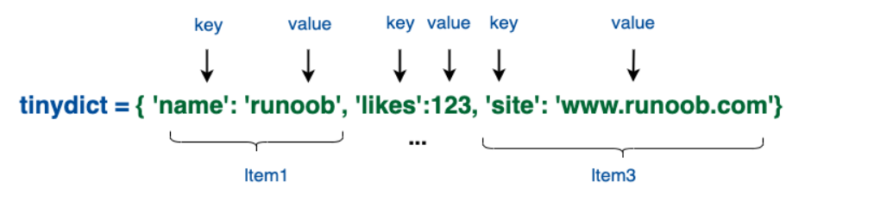

# Python

Python是一门解释型、面向对象、动态数据类型的高级设计语言。Python由Guido van Rossum于1989年底发明。第一个公开发行版与1991年，类似Perl语言一样，Python源代码遵循GPL(GNU General Public License)协议。**官方宣布，2020年1月1日，停止Python 2的更新。Python 2.7被确定为最后一个Python 2.x版本。**

## 第一个Python程序

输出 Hello World

```python
#!/usr/bin/python3
# -*- coding: UTF-8 -*-

print("Hello World")
```

## 简介

Python是一个高层次的结合了解释性、编译性、互动性和面向对象的脚本语言。Python的设计具有很强的可读性。

- 解释性：没有编译环节。类似于PHP和Perl。
- 交互性：可在交互窗口进行编写和运行。

- 面向对象：支持面向对象编程和代码封装。
- 易学：简单、容易上手。

## 特点

1、易于学习

2、易于阅读

3、易于维护

4、广泛的标准库

5、互动模式

6、可移植

7、可扩展

8、数据库

9、GUI编程

10、可嵌入

## 环境配置

windows环境配置：

```python
# python安装路径
c:\python
    
path=%path%;c:/python
```

环境变量：

|    变量名     |                             描述                             |
| :-----------: | :----------------------------------------------------------: |
|  PYTHONPATH   | PYTHONPATH是Python搜索路径，默认import的模块都会从PYTHONPATH里面寻找。 |
| PYTHONSTARTUP | Python启动后，先寻找PYTHONSTARTUP环境变量，然后执行此变量指定的文件中的代码。 |
| PYTHONCASEOK  | 加入PYTHONCASEOK的环境变量, 就会使python导入模块的时候不区分大小写. |
|  PYTHONHOME   | 另一种模块搜索路径。它通常内嵌于的PYTHONSTARTUP或PYTHONPATH目录中，使得两个模块库更容易切换。 |


## 标识符

- python 标识符由字母、数字、下划线组成
- python 所有标识符可包括英文、数字以及下划线(_)，但不能以数字开头
- python 标识符区分大小写


标识符特殊意义：

1、以单个下划线开头_begin的代表不能直接访问类的属性，需要通过类提供的接口访问，不能使用from xxx

import * 导入。

2、以双下划线开头__begin代表类的私有成员

3、以双下划线开头和结尾的\_\_begin\_\_代表python里特殊方法专用的标识符。如：\_\_init\_\_()代表类的构造函数。

## 保留字(关键字)

Python 的关键字只包含小写字母。

|   and    |  exec   |  not   |
| :------: | :-----: | :----: |
|  assert  | finally |   or   |
|  break   |   for   |  pass  |
|  class   |  from   | print  |
| continue | global  | raise  |
|   def    |   if    | return |
|   del    | import  |  try   |
|   elif   |   in    | while  |
|   else   |   is    |  with  |
|  except  | lambda  | yield  |

## 行与缩进

在 Python 的代码块中必须使用相同数目的行首缩进空格数。

在每个缩进层次使用 **单个制表符** 或 **两个空格** 或 **四个空格** , 切记不能混用

- 缩进为4个空格

```python
# 缩进四个空格
for i in range(10):
    print(i)
```

## 多行语句

Python语句中一般以新行作为语句的结束符。使用斜杠（ \）将一行的语句分为多行显示，如下所示：

```python
list = list_one + \
	   list_two + \
        list_three
```

在包含 [], {}, ()括号语句不需要使用多行连接符：

```python
test_list = [1, 2, 3, 4, 5, 6]
```

## 引号

Python中使用单引号('')、双引号("")、三引号(""" """)表示字符串。开始与结束类型必须相同。其中三引号可以由多行组成，编写多行文本的快捷语法，常用于文档字符串，在文件的特定地点，被当做注释。 

```python
speak_one = 'word' # 单引号
speak_two = "hello world" # 双引号
speak_nums = """
	I.m jack 
	hello wolrd
""" # 三引号
```

## 注释

- 单行注释采用#开头

```python
# 这是一个单行注释
print("这是一个单行注释")
```

- 多行注释

```python
'''
这是一个多行注释，使用单引号
'''
print("这是一个多行注释，使用单引号")

"""
这是一个多行注释，使用双引号
"""
print("这是一个多行注释，使用双引号")
```


## 变量

1、变量赋值

Python中的变量赋值不需要声明数据类型，每个变量在内存中创建，包括变量的标识、名称、数据等信息，每个变量在使用前都必须对其进行赋值，变量赋值后，才会被创建。

**使用等号 = 对变量进行赋值**

```python
one = 1 # 赋值整型变量
two = 2
three = 3

float_one = 1.1 # 赋值浮点型

double_two = 1.100 

string_noe = "jack" # 赋值字符串
```

2、多个变量进行赋值

对多个变量同时进行赋值

```python
# 多个变量同时赋值
a = b = c = 1

# 两个整型对象 1 和 2 分别分配给变量 a 和 b，字符串对象 "jack" 分配给变量 c。
a, b, c = 1, 2, "jack"
```

## 数据类型

Python标准的数据类型

- Number（数字）
- String（字符串）
- List（列表）
- Tuple（元组）
- Set（集合）
- Dictionary（字典）


标准数据类型中：

- **不可变数据（3 个）：**Number（数字）、String（字符串）、Tuple（元组）
- **可变数据（3 个）：**List（列表）、Dictionary（字典）、Set（集合）

### Numbers（数字）

数字数据类型用于存储数值。不可改变的数据类型，如果改变数字数据类型，将会分配一个新的对象。

```python
# 创建Numbers
num_one = 1
num_two = 2

# 删除
del num_one[, num_two[, num_three, num_n...]]
del num_one # 删除单个对象
del num_one, num_two # 删除多个对象
```

支持四种不同的数字类型

- int（有符号整型）
- long（长整型，也可以代表八进制和十六进制）
- float（浮点型）
- complex（复数）


内置的type()函数可查询变量所指的对象类型

```python
a, b, c, d = 20, 5.5, True, 4 + 3j
print(type(a), type(b), type(c), type(d))

# 也可使用isinstance进行判断
a = 10
print(isinstance(a, int))
```

isinstance和type的区别：

- type()不会认为子类是一种父类类型
- isinstance()会认为子类是一种父类类型

```python
>>> class A:
...     pass
... 
>>> class B(A):
...     pass
... 
>>> isinstance(A(), A)
True
>>> type(A()) == A 
True
>>> isinstance(B(), A)
True
>>> type(B()) == A
False


# Python3中， bool是int的子类， True 和 False可以和数字相加， True == 1, False == 0 会返回True，
# 但可以通过is来判断
>>> issubclass(bool, int) 
True
>>> True==1
True
>>> False==0
True
>>> True+1
2
>>> False+1
1
>>> 1 is True
False
>>> 0 is False
False
```

数值类型的实例：

|  int   |         long          |   float    |  complex   |
| :----: | :-------------------: | :--------: | :--------: |
|   10   |       51924361L       |    0.0     |   3.14j    |
|  100   |       -0x19323L       |   15.20    |    45.j    |
|  -786  |         0122L         |   -21.9    | 9.322e-36j |
|  080   | 0xDEFABCECBDAECBFBAEl |  32.3e+18  |   .876j    |
| -0490  |     535633629843L     |    -90.    | -.6545+0J  |
| -0x260 |    -052318172735L     | -32.54e100 |   3e+26J   |
|  0x69  |    -4721885298529L    |  70.2E-12  |  4.53e-7j  |

- 长整型可使用小写 l，但建议使用大写 L，避免与数字 1 混淆。Python使用 L 来显示长整型。
- Python 还支持复数，复数由实数部分和虚数部分构成，可以用 a + bj,或者 complex(a,b) 表示， 复数的实部 a 和虚部 b 都是浮点型。

数值运算：

```python
>>> 5 + 4  # 加法
9
>>> 4.3 - 2 # 减法
2.3
>>> 3 * 7  # 乘法
21
>>> 2 / 4  # 除法，得到一个浮点数
0.5
>>> 2 // 4 # 除法，得到一个整数
0
>>> 17 % 3 # 取余
2
>>> 2 ** 5 # 乘方
32
```

**注意：**

- 1、Python可以同时为多个变量赋值，如a, b = 1, 2。
- 2、一个变量可以通过赋值指向不同类型的对象。
- 3、数值的除法包含两个运算符：**/** 返回一个浮点数，**//** 返回一个整数。
- 4、在混合计算时，Python会把整型转换成为浮点数。

### String(字符串)

Python中的字符串用单引号 **'** 或双引号 **"** 括起来，同时使用反斜杠 **\** 转义特殊字符。

字符串的截取的语法格式如下：

```python
变量[头下标:尾下标]
```

字符串或串(String)由数字、字母、下划线组成的一串字符

```python
# n >= 0, 字符串表示文本的数据类型
str_one "a1a2a3...an"
```

字符串列表取值顺序

1、从左到右，默认 0 开始，最大长度范围是字符串的长度-1 

```python
print(len(str_one) - 1)
```

2、从右到左，默认 -1 开始，最大范围是字符串的开头

```python
# 解释
 a  b  c  d  e
 0  1  2  3  4 
-5 -4 -3 -2 -1
```

3、取子字符串，使用 [ 头下标 : 尾下标 ]。 

下标是从 0 开始算起，可以是正数或负数，下标可以为空表示取到头或尾。 

 **[头下标:尾下标]** 获取的子字符串包含头下标的字符，但不包含尾下标的字符。 

```python
s = 'abcdef'
print(s[1:5])

'bcde'
```


```python
# 加号（+）是字符串连接运算符，星号（*）是重复操作
str_one = 'Hello world!'

print(str_one) # 输出完整字符串 Hello World
print(str_one[0]) # 输出字符串的第一个字符 H
print(str_one[2:5]) # 输出字符串中第三个至第六个的字符串 llo
print(str_one[2:]) # 输出从第三个字符串开始的字符串 llo World!
print(str_one * 2) # 输出字符串两次 Hello World!Hello World!
print(str_one + 'jack') # 输出连接的字符串 Hello World! jack
```

Python 使用反斜杠转义特殊字符，如果你不想让反斜杠发生转义，可以在字符串前面添加一个 **r**，表示原始字符串： 

```python
>>> print('ja\ck')
ja
ck
>>> print(r'ja\ck')
ja\ck
```

反斜杠(\)可以作为续行符，表示下一行是上一行的延续。也可以使用 **"""..."""** 或者 **'''...'''** 跨越多行。

注意，Python 没有单独的字符类型，一个字符就是长度为1的字符串。

```python
>>> word = 'Python'
>>> print(word[0], word[5])
P n
>>> print(word[-1], word[-6])
n P
```

Python 字符串不能被改变。向一个索引位置赋值，比如word[0] = 'm'会导致错误。

**注意：**

- 1、反斜杠可以用来转义，使用r可以让反斜杠不发生转义。
- 2、字符串可以用+运算符连接在一起，用*运算符重复。
- 3、Python中的字符串有两种索引方式，从左往右以0开始，从右往左以-1开始。
- 4、Python中的字符串不能改变。

### List(列表)

List(列表)是 Python 中使用最频繁的数据类型。列表可以完成大多数集合类的数据结构实现。它支持字符，数字，字符串甚至可以包含列表（即嵌套）。

列表用 **[ ]** 标识，是 python 最通用的复合数据类型。列表中值的切割也可以用到变量 **[头下标:尾下标]** ，就可以截取相应的列表，从左到右索引默认 0 开始，从右到左索引默认 -1 开始，下标可以为空表示取到头或尾。


列表截取可以接收第三个参数，参数作用是截取的步长，以下实例在索引 1 到索引 4 的位置并设置为步长为 2（间隔一个位置）来截取字符串： 


```python
>>> a = [1, 2, 3, 4, 5, 6]
>>> a[0] = 9
>>> a[2:5] = [13, 14, 15]
>>> a
[9, 2, 13, 14, 15, 6]
>>> a[2:5] = []   # 将对应的元素值设置为 []
>>> a
[9, 2, 6]
```

List 内置了有很多方法，如 append()、pop() 等

**注意：**

- 1、List写在方括号之间，元素用逗号隔开。
- 2、和字符串一样，list可以被索引和切片。
- 3、List可以使用+操作符进行拼接。
- 4、List中的元素是可以改变的。

如果第三个参数为负数表示逆向读取，以下实例用于翻转字符串： 

```python
def reverseWords(input):
     
    # 通过空格将字符串分隔符，把各个单词分隔为列表
    inputWords = input.split(" ")
 
    # 翻转字符串
    # 假设列表 list = [1,2,3,4],  
    # list[0]=1, list[1]=2 ，而 -1 表示最后一个元素 list[-1]=4 ( 与 list[3]=4 一样)
    # inputWords[-1::-1] 有三个参数
    # 第一个参数 -1 表示最后一个元素
    # 第二个参数为空，表示移动到列表末尾
    # 第三个参数为步长，-1 表示逆向
    inputWords=inputWords[-1::-1]
 
    # 重新组合字符串
    output = ' '.join(inputWords)
     
    return output
 
if __name__ == "__main__":
    input = 'I like jack'
    rw = reverseWords(input)
    print(rw)
```

- `append(x)` 把元素 x 放在入列表尾部
- `count(x)` 统计元素 x 在列表中出现次数
- `extent(seq)` 把新列表 seq 合并到列表尾部
- `index(x)` 返回元素 x 在列表第一次出现的位置
- `insert(index, x)` 把元素 x 插入到 index 位置
- `pop(index)` 删除并返回 index 所在位置的元素
- `remove(x)` 删除出现的第一个 x 元素
- `reverse()` 颠倒列表顺序
- `sort()` 对列表进行排序

### Tuple(元组)

元组（tuple）与列表类似，不同之处在于元组的元素不能修改。元组写在小括号 **()** 里，元素之间用逗号隔开。元组中的元素类型也可以不相同：

```python
tuple = ( 'abcd', 786 , 2.23, 'jack', 70.2  )
tinytuple = (123, 'jack')

print (tuple)             # 输出完整元组
print (tuple[0])          # 输出元组的第一个元素
print (tuple[1:3])        # 输出从第二个元素开始到第三个元素
print (tuple[2:])         # 输出从第三个元素开始的所有元素
print (tinytuple * 2)     # 输出两次元组
print (tuple + tinytuple) # 连接元组


output:
('abcd', 786, 2.23, 'jack', 70.2)
abcd
(786, 2.23)
(2.23, 'jack', 70.2)
(123, 'jack', 123, 'jack')
('abcd', 786, 2.23, 'jack', 70.2, 123, 'jack')

# 元组与字符串类似，可以被索引且下标索引从0开始，-1 为从末尾开始的位置。
```

Tuple的元素不可改变，但它可以包含可变的对象，比如list列表。

构造包含 0 个或 1 个元素的元组比较特殊，所以有一些额外的语法规则：

```python
tup1 = () # 空元组
tup2 = (20, ) # 一个元素，需要在元素后添加逗号
```

string、list 和 tuple 都属于 sequence（序列）。

**注意：**

- 1、与字符串一样，元组的元素不能修改。
- 2、元组也可以被索引和切片，方法一样。
- 3、注意构造包含 0 或 1 个元素的元组的特殊语法规则。
- 4、元组也可以使用+操作符进行拼接。

### Set(集合)

集合（set）是由一个或数个形态各异的大小整体组成的，构成集合的事物或对象称作元素或是成员。

基本功能是进行成员关系测试和删除重复元素。使用大括号 **{ }** 或者 **set()** 函数创建集合。

注意：创建一个空集合必须用 **set()** 而不是 **{ }**，因为 **{ }** 是用来创建一个空字典。

创建格式：

```python
Set_name = (value_one, value_two,...)
# 或
set(name)
```

```python
sites = {'Google', 'Taobao', 'jack', 'Facebook', 'Zhihu', 'Baidu'}

print(sites)   # 输出集合，重复的元素被自动去掉

# 成员测试
if 'jack' in sites :
    print('jack 在集合中')
else :
    print('jack 不在集合中')


# set可以进行集合运算
a = set('abracadabra')
b = set('alacazam')

print(a)

print(a - b)     # a 和 b 的差集

print(a | b)     # a 和 b 的并集

print(a & b)     # a 和 b 的交集

print(a ^ b)     # a 和 b 中不同时存在的元素


output:
{'Zhihu', 'Baidu', 'Taobao', 'jack', 'Google', 'Facebook'}
Runoob 在集合中
{'b', 'c', 'a', 'r', 'd'}
{'r', 'b', 'd'}
{'b', 'c', 'a', 'z', 'm', 'r', 'l', 'd'}
{'c', 'a'}
{'z', 'b', 'm', 'r', 'l', 'd'}
```

- `add(x)` 向集合中添加元素 x
- `clear()` 清空集合
- `copy()` 返回集合的一个复制
- `difference(set)` 返回集合与另一个集合的差集
- `discard(x)` 删除元素 x
- `isdisjoint(set)` 判断两个集合是否有交集
- `issubset(set)` 判断新集合 set 是否是集合的子集
- `issuperset()` 判断新集合 set 是否是集合的超集

### Dictionary（字典）

字典(dictionary)是除列表以外python之中最灵活的内置数据结构类型。列表是有序的对象集合，字典是无序的对象集合。两者之间的区别在于：字典当中的元素是通过键来存取的，而不是通过偏移存取。

字典用"{ }"标识。字典由索引(key)和它对应的值value组成。

```python
dict = {}
dict['one'] = "This is one"
dict[2] = "This is two"
 
tinydict = {'name': 'jack','code':6734, 'dept': 'sales'}
 
 
print(dict['one'])          # 输出键为'one' 的值
print(dict[2])              # 输出键为 2 的值
print(tinydict)             # 输出完整的字典
print(tinydict.keys())      # 输出所有键
print(tinydict.values())    # 输出所有值

output:
This is one
This is two
{'dept': 'sales', 'code': 6734, 'name': 'jack'}
['dept', 'code', 'name']
['sales', 6734, 'jack']
```

- `clear()` 清楚字典内所有元素
- `copy()` 返回字典的一个复制
- `has_key(key)` 检查 key 是否在字典中
- `items()` 返回一个含由 (key, value) 格式元组构成的列表
- `keys()` 返回由键构成列表
- `values()` 返回由值构成的列表
- `setdefault(key, default)` 为键 key 添加默认值 default
- `pop(key)` 删除 key 并返回对应的值

**注意：**

- 1、字典是一种映射类型，它的元素是键值对。
- 2、字典的关键字必须为不可变类型，且不能重复。
- 3、创建空字典使用 **{ }**。


## 数据类型转换

|                             函数                             |                        描述                         |
| :----------------------------------------------------------: | :-------------------------------------------------: |
| [int(x [,base\])](https://www.runoob.com/python/python-func-int.html) |                  将x转换为一个整数                  |
| [long(x [,base\] )](https://www.runoob.com/python/python-func-long.html) |                 将x转换为一个长整数                 |
| [float(x)](https://www.runoob.com/python/python-func-float.html) |                 将x转换到一个浮点数                 |
| [complex(real [,imag\])](https://www.runoob.com/python/python-func-complex.html) |                    创建一个复数                     |
| [str(x)](https://www.runoob.com/python/python-func-str.html) |                将对象 x 转换为字符串                |
| [repr(x)](https://www.runoob.com/python/python-func-repr.html) |             将对象 x 转换为表达式字符串             |
| [eval(str)](https://www.runoob.com/python/python-func-eval.html) | 用来计算在字符串中的有效Python表达式,并返回一个对象 |
| [tuple(s)](https://www.runoob.com/python/att-tuple-tuple.html) |               将序列 s 转换为一个元组               |
| [list(s)](https://www.runoob.com/python/att-list-list.html)  |               将序列 s 转换为一个列表               |
| [set(s)](https://www.runoob.com/python/python-func-set.html) |                   转换为可变集合                    |
| [dict(d)](https://www.runoob.com/python/python-func-dict.html) |  创建一个字典。d 必须是一个序列 (key,value)元组。   |
| [frozenset(s)](https://www.runoob.com/python/python-func-frozenset.html) |                  转换为不可变集合                   |
| [chr(x)](https://www.runoob.com/python/python-func-chr.html) |              将一个整数转换为一个字符               |
| [unichr(x)](https://www.runoob.com/python/python-func-unichr.html) |             将一个整数转换为Unicode字符             |
| [ord(x)](https://www.runoob.com/python/python-func-ord.html) |             将一个字符转换为它的整数值              |
| [hex(x)](https://www.runoob.com/python/python-func-hex.html) |         将一个整数转换为一个十六进制字符串          |
| [oct(x)](https://www.runoob.com/python/python-func-oct.html) |          将一个整数转换为一个八进制字符串           |

## 隐式类型转换

在隐式类型转换中，Python会自动将一种数据类型转换为另外一种数据类型，不需要认为干涉。

```python
num_one = 1
num_two = 1.2

num_three = num_one + num_two

print("num_three ", num_three)
#因为 Python 会将较小的数据类型转换为较大的数据类型，以避免数据丢失。
```


## 显示类型转换

在显示类型转换中，用户将对象的数据类型转换为需要的数据类型。也称为“强制转换”, 使用 int()、float()、str() 等预定义函数来执行显式类型转换。 

int()强制转换整型

```python
x = int(1) # 1
y = int(1.2) # 1
z = int("3") # 3
```

float()强制转换浮点型

```python
x = float(1) # 1.0
y = float(2.8) # 2.8
z = float("4.2") # 4.2
```

str()强制转换为字符串类型

```python
x = str("s1") # 's1'
y = str(2) # '2'
z = str(3.0) # '3.0'
```

## 推导式

Python 推导式是一种独特的数据处理方式，可以从一个数据序列构建另一个新的数据序列的结构体。 

数据结构的推导式：

- 列表(list)推导式
- 字典(dict)推导式
- 集合(set)推导式
- 元组(tuple)推导式

### 列表推导式

列表推导式格式为：

```python
[表达式 for 变量 in 列表] 
[out_exp_res for out_exp in input_list]

# 或者 

[表达式 for 变量 in 列表 if 条件]
[out_exp_res for out_exp in input_list if condition]
```

- out_exp_res：列表生成元素表达式，可以是有返回值的函数。
- for out_exp in input_list：迭代 input_list 将 out_exp 传入到 out_exp_res 表达式中。
- if condition：条件语句，可以过滤列表中不符合条件的值。


过滤掉长度小于或等于3的字符串列表，并将剩下的转换成大写字母： 

```python
names = ['bob', 'tom', 'alice', 'jerry', 'wendy', 'smith']
new_names = [name.upper() for name in names if len(name) > 3]
print(new_names)
```

计算 30 以内可以被 3 整除的整数： 

```python
multiples = [i for i in range(30) if i % 3 == 0]
print(multiples)
```

### 字典推导式

字典推导基本格式：

```python
{ key_expr: value_expr for value in collection }

# 或

{ key_expr: value_expr for value in collection if condition }
```

使用字符串及其长度创建字典： 

```python
list_one = ['google', 'jack', 'taobao']
new_dict = {key:len(key) for key in list_one}
print(new_dict)
```

提供三个数字，以三个数字为键，三个数字的平方为值来创建字典： 

```python
dict_nums = {x: x ** 2 for x in (2, 4, 6)}
print(dict_nums) # {2： 4， 4： 16， 6： 36}
```

### 集合推导式

集合推导式基本格式：

```python
{ expression for item in Sequence }

# 或

{ expression for item in Sequence if conditional }
```

计算数字 1,2,3 的平方数

```python
set_nums = {i ** 2 for in (1, 2, 3)}
print(set_nums)
```

判断不是 abc 的字母并输出 

```python
a = {x for x in 'abracadabra' is x not in 'abc'}
print(a)
```

### 元组推导式(生成器迭代式)

元组推导式可以利用 range 区间、元组、列表、字典和集合等数据类型，快速生成一个满足指定需求的元组。

元组推导式基本格式：

```python
(expression for item in Sequence )

# 或

(expression for item in Sequence if conditional )
```

元组推导式和列表推导式的用法也完全相同，只是元组推导式是用 **()** 圆括号将各部分括起来，而列表推导式用的是中括号 **[]**，另外元组推导式返回的结果是一个生成器对象。


生成一个包含数字 1~9 的元组 

```python
# 返回的是生成器对象
a = (x for i in range(1, 10))
print(a)

# 使用 tuple() 函数，可以直接将生成器对象转换成元组
print(tuple(a)) # (1, 2, 3, 4, 5, 6, 7, 8, 9)
```

## 运算符

### 算数运算符

| 运算符 |                      描述                       |          实例          |
| :----: | :---------------------------------------------: | :--------------------: |
|   +    |                加 - 两个对象相加                |   a + b 输出结果 31    |
|   -    |       减 - 得到负数或是一个数减去另一个数       |   a - b 输出结果 -11   |
|   *    | 乘 - 两个数相乘或是返回一个被重复若干次的字符串 |   a * b 输出结果 210   |
|   /    |                  除 - x 除以 y                  |   b / a 输出结果 2.1   |
|   %    |              取模 - 返回除法的余数              |    b % a 输出结果 1    |
|   **   |                幂 - 返回x的y次幂                |   a**b 为10的21次方    |
|   //   |           取整除 - 向下取接近商的整数           | `9//2 = 4  -9//2 = -5` |

```python
a = 21
b = 10
c = 0
 
c = a + b
print ("1 - c 的值为：", c)
 
c = a - b
print ("2 - c 的值为：", c)
 
c = a * b
print ("3 - c 的值为：", c)
 
c = a / b
print ("4 - c 的值为：", c)
 
c = a % b
print ("5 - c 的值为：", c)
 
# 修改变量 a 、b 、c
a = 2
b = 3
c = a**b 
print ("6 - c 的值为：", c)
 
a = 10
b = 5
c = a//b 
print ("7 - c 的值为：", c)

output:
1 - c 的值为： 31
2 - c 的值为： 11
3 - c 的值为： 210
4 - c 的值为： 2.1
5 - c 的值为： 1
6 - c 的值为： 8
7 - c 的值为： 2
```

### 比较运算符

| 运算符 |                             描述                             |         实例          |
| :----: | :----------------------------------------------------------: | :-------------------: |
|   ==   |                   等于 - 比较对象是否相等                    | (a == b) 返回 False。 |
|   !=   |               不等于 - 比较两个对象是否不相等                | (a != b) 返回 True。  |
|   >    |                    大于 - 返回x是否大于y                     | (a > b) 返回 False。  |
|   <    | 小于 - 返回x是否小于y。所有比较运算符返回1表示真，返回0表示假。这分别与特殊的变量True和False等价。注意，这些变量名的大写。 |  (a < b) 返回 True。  |
|   >=   |               大于等于 - 返回x是否大于等于y。                | (a >= b) 返回 False。 |
|   <=   |               小于等于 - 返回x是否小于等于y。                | (a <= b) 返回 True。  |

```python
a = 21
b = 10
c = 0
 
if ( a == b ):
   print ("1 - a 等于 b")
else:
   print ("1 - a 不等于 b")
 
if ( a != b ):
   print ("2 - a 不等于 b")
else:
   print ("2 - a 等于 b")
 
if ( a < b ):
   print ("3 - a 小于 b")
else:
   print ("3 - a 大于等于 b")
 
if ( a > b ):
   print ("4 - a 大于 b")
else:
   print ("4 - a 小于等于 b")
 
# 修改变量 a 和 b 的值
a = 5
b = 20
if ( a <= b ):
   print ("5 - a 小于等于 b")
else:
   print ("5 - a 大于  b")
 
if ( b >= a ):
   print ("6 - b 大于等于 a")
else:
   print ("6 - b 小于 a")


output:
1 - a 不等于 b
2 - a 不等于 b
3 - a 大于等于 b
4 - a 大于 b
5 - a 小于等于 b
6 - b 大于等于 a
```

### 赋值运算符

| 运算符 |                             描述                             |                             实例                             |
| :----: | :----------------------------------------------------------: | :----------------------------------------------------------: |
|   =    |                       简单的赋值运算符                       |            c = a + b 将 a + b 的运算结果赋值为 c             |
|   +=   |                        加法赋值运算符                        |                   c += a 等效于 c = c + a                    |
|   -=   |                        减法赋值运算符                        |                   c -= a 等效于 c = c - a                    |
|   *=   |                        乘法赋值运算符                        |                   c *= a 等效于 c = c * a                    |
|   /=   |                        除法赋值运算符                        |                   c /= a 等效于 c = c / a                    |
|   %=   |                        取模赋值运算符                        |                   c %= a 等效于 c = c % a                    |
|  **=   |                         幂赋值运算符                         |                  c **= a 等效于 c = c ** a                   |
|  //=   |                       取整除赋值运算符                       |                  c //= a 等效于 c = c // a                   |
|   :=   | 海象运算符，可在表达式内部为变量赋值。**Python3.8 版本新增运算符**。 | 在这个示例中，赋值表达式可以避免调用 len() 两次:`if (n := len(a)) > 10:    print(f"List is too long ({n} elements, expected <= 10)")` |

```python
a = 21
b = 10
c = 0
 
c = a + b
print ("1 - c 的值为：", c)
 
c += a
print ("2 - c 的值为：", c)
 
c *= a
print ("3 - c 的值为：", c)
 
c /= a 
print ("4 - c 的值为：", c)
 
c = 2
c %= a
print ("5 - c 的值为：", c)
 
c **= a
print ("6 - c 的值为：", c)
 
c //= a
print ("7 - c 的值为：", c)

output:
1 - c 的值为： 31
2 - c 的值为： 52
3 - c 的值为： 1092
4 - c 的值为： 52.0
5 - c 的值为： 2
6 - c 的值为： 2097152
7 - c 的值为： 99864
```

### 位运算符

按位运算符是把数字看作二进制来进行计算的。 Python中的按位运算法则如下：

下表中变量 a 为 60，b 为 13二进制格式如下：

```python
a = 0011 1100

b = 0000 1101

-----------------

a&b = 0000 1100

a|b = 0011 1101

a^b = 0011 0001

~a  = 1100 0011
```

| 运算符 |                             描述                             |                             实例                             |
| :----: | :----------------------------------------------------------: | :----------------------------------------------------------: |
|   &    | 按位与运算符：参与运算的两个值,如果两个相应位都为1,则该位的结果为1,否则为0 |         (a & b) 输出结果 12 ，二进制解释： 0000 1100         |
|   \|   | 按位或运算符：只要对应的二个二进位有一个为1时，结果位就为1。 |        (a \| b) 输出结果 61 ，二进制解释： 0011 1101         |
|   ^    |       按位异或运算符：当两对应的二进位相异时，结果为1        |         (a ^ b) 输出结果 49 ，二进制解释： 0011 0001         |
|   ~    | 按位取反运算符：对数据的每个二进制位取反,即把1变为0,把0变为1。**~x** 类似于 **-x-1** | (~a ) 输出结果 -61 ，二进制解释： 1100 0011， 在一个有符号二进制数的补码形式。 |
|   <<   | 左移动运算符：运算数的各二进位全部左移若干位，由"<<"右边的数指定移动的位数，高位丢弃，低位补0。 |         a << 2 输出结果 240 ，二进制解释： 1111 0000         |
|   >>   | 右移动运算符：把">>"左边的运算数的各二进位全部右移若干位，">>"右边的数指定移动的位数 |         a >> 2 输出结果 15 ，二进制解释： 0000 1111          |

```python
a = 60            # 60 = 0011 1100 
b = 13            # 13 = 0000 1101 
c = 0
 
c = a & b        # 12 = 0000 1100
print ("1 - c 的值为：", c)
 
c = a | b        # 61 = 0011 1101 
print ("2 - c 的值为：", c)
 
c = a ^ b        # 49 = 0011 0001
print ("3 - c 的值为：", c)
 
c = ~a           # -61 = 1100 0011
print ("4 - c 的值为：", c)
 
c = a << 2       # 240 = 1111 0000
print ("5 - c 的值为：", c)
 
c = a >> 2       # 15 = 0000 1111
print ("6 - c 的值为：", c)

output:
1 - c 的值为： 12
2 - c 的值为： 61
3 - c 的值为： 49
4 - c 的值为： -61
5 - c 的值为： 240
6 - c 的值为： 15
```

### 逻辑运算符

Python语言支持逻辑运算符.

| 运算符 | 逻辑表达式 |                             描述                             |          实例           |
| :----: | :--------: | :----------------------------------------------------------: | :---------------------: |
|  and   |  x and y   | 布尔"与" - 如果 x 为 False，x and y 返回 x 的值，否则返回 y 的计算值。 |    (a and b) 返回 b     |
|   or   |   x or y   | 布尔"或" - 如果 x 是 True，它返回 x 的值，否则它返回 y 的计算值。 |     (a or b) 返回 a     |
|  not   |   not x    | 布尔"非" - 如果 x 为 True，返回 False 。如果 x 为 False，它返回 True。 | not(a and b) 返回 False |

```python
a = 10
b = 20
 
if ( a and b ):
   print ("1 - 变量 a 和 b 都为 true")
else:
   print ("1 - 变量 a 和 b 有一个不为 true")
 
if ( a or b ):
   print ("2 - 变量 a 和 b 都为 true，或其中一个变量为 true")
else:
   print ("2 - 变量 a 和 b 都不为 true")
 
# 修改变量 a 的值
a = 0
if ( a and b ):
   print ("3 - 变量 a 和 b 都为 true")
else:
   print ("3 - 变量 a 和 b 有一个不为 true")
 
if ( a or b ):
   print ("4 - 变量 a 和 b 都为 true，或其中一个变量为 true")
else:
   print ("4 - 变量 a 和 b 都不为 true")
 
if not( a and b ):
   print ("5 - 变量 a 和 b 都为 false，或其中一个变量为 false")
else:
   print ("5 - 变量 a 和 b 都为 true")

output:
1 - 变量 a 和 b 都为 true
2 - 变量 a 和 b 都为 true，或其中一个变量为 true
3 - 变量 a 和 b 有一个不为 true
4 - 变量 a 和 b 都为 true，或其中一个变量为 true
5 - 变量 a 和 b 都为 false，或其中一个变量为 false
```

### 成员运算符

| 运算符 |                          描述                           |                       实例                        |
| :----: | :-----------------------------------------------------: | :-----------------------------------------------: |
|   in   |   如果在指定的序列中找到值返回 True，否则返回 False。   |   x 在 y 序列中 , 如果 x 在 y 序列中返回 True。   |
| not in | 如果在指定的序列中没有找到值返回 True，否则返回 False。 | x 不在 y 序列中 , 如果 x 不在 y 序列中返回 True。 |

```python
a = 10
b = 20
list = [1, 2, 3, 4, 5 ]
 
if ( a in list ):
   print ("1 - 变量 a 在给定的列表中 list 中")
else:
   print ("1 - 变量 a 不在给定的列表中 list 中")
 
if ( b not in list ):
   print ("2 - 变量 b 不在给定的列表中 list 中")
else:
   print ("2 - 变量 b 在给定的列表中 list 中")
 
# 修改变量 a 的值
a = 2
if ( a in list ):
   print ("3 - 变量 a 在给定的列表中 list 中")
else:
   print ("3 - 变量 a 不在给定的列表中 list 中")

output:
1 - 变量 a 不在给定的列表中 list 中
2 - 变量 b 不在给定的列表中 list 中
3 - 变量 a 在给定的列表中 list 中
```

### 身份运算符

身份运算符用于比较两个对象的存储单元

| 运算符 |                    描述                     |                             实例                             |
| :----: | :-----------------------------------------: | :----------------------------------------------------------: |
|   is   |   is 是判断两个标识符是不是引用自一个对象   | **x is y**, 类似 **id(x) == id(y)** , 如果引用的是同一个对象则返回 True，否则返回 False |
| is not | is not 是判断两个标识符是不是引用自不同对象 | **x is not y** ， 类似 **id(x) != id(y)**。如果引用的不是同一个对象则返回结果 True，否则返回 False。 |

**注意：id()函数用于获取对象内存的地址**

```python
a = 20
b = 20
 
if ( a is b ):
   print ("1 - a 和 b 有相同的标识")
else:
   print ("1 - a 和 b 没有相同的标识")
 
if ( id(a) == id(b) ):
   print ("2 - a 和 b 有相同的标识")
else:
   print ("2 - a 和 b 没有相同的标识")
 
# 修改变量 b 的值
b = 30
if ( a is b ):
   print ("3 - a 和 b 有相同的标识")
else:
   print ("3 - a 和 b 没有相同的标识")
 
if ( a is not b ):
   print ("4 - a 和 b 没有相同的标识")
else:
   print ("4 - a 和 b 有相同的标识")

output:
1 - a 和 b 有相同的标识
2 - a 和 b 有相同的标识
3 - a 和 b 没有相同的标识
4 - a 和 b 没有相同的标识
```

```python
# is 与 == 区别：
# is 用于判断两个变量引用对象是否为同一个， == 用于判断引用变量的值是否相等。
>>>a = [1, 2, 3]
>>> b = a
>>> b is a 
True
>>> b == a
True
>>> b = a[:]
>>> b is a
False
>>> b == a
True
```

### 运算符优先级

从最高到最低优先级的所有运算符， 相同单元格内的运算符具有相同优先级。 运算符均指二元运算，除非特别指出。 相同单元格内的运算符从左至右分组（除了幂运算是从右至左分组）： 

|                            运算符                            |                描述                |
| :----------------------------------------------------------: | :--------------------------------: |
| `(expressions...)`,`[expressions...]`, `{key: value...}`, `{expressions...}` |           圆括号的表达式           |
| `x[index]`, `x[index:index]`, `x(arguments...)`, `x.attribute` |     读取，切片，调用，属性引用     |
|                           await x                            |            await 表达式            |
|                             `**`                             |             乘方(指数)             |
|                       `+x`, `-x`, `~x`                       |         正，负，按位非 NOT         |
|                   `*`, `@`, `/`, `//`, `%`                   |     乘，矩阵乘，除，整除，取余     |
|                           `+`, `-`                           |               加和减               |
|                          `<<`, `>>`                          |                移位                |
|                             `&`                              |             按位与 AND             |
|                             `^`                              |            按位异或 XOR            |
|                             `|`                              |             按位或 OR              |
|         `in,not in, is,is not, <, <=, >, >=, !=, ==`         | 比较运算，包括成员检测和标识号检测 |
|                           `not x`                            |             逻辑非 NOT             |
|                            `and`                             |             逻辑与 AND             |
|                             `or`                             |             逻辑或 OR              |
|                         `if -- else`                         |             条件表达式             |
|                           `lambda`                           |           lambda 表达式            |
|                             `:=`                             |             赋值表达式             |


## Number(数字)

### 数学函数

|                             函数                             |                       返回值 ( 描述 )                        |
| :----------------------------------------------------------: | :----------------------------------------------------------: |
| [abs(x)](https://www.runoob.com/python3/python3-func-number-abs.html) |             返回数字的绝对值，如abs(-10) 返回 10             |
| [ceil(x)](https://www.runoob.com/python3/python3-func-number-ceil.html) |         返回数字的上入整数，如math.ceil(4.1) 返回 5          |
|                          cmp(x, y)                           | 如果 x < y 返回 -1, 如果 x == y 返回 0, 如果 x > y 返回 1。 **Python 3 已废弃，使用 (x>y)-(x。 |
| [exp(x)](https://www.runoob.com/python3/python3-func-number-exp.html) |     返回e的x次幂(ex),如math.exp(1) 返回2.718281828459045     |
| [fabs(x)](https://www.runoob.com/python3/python3-func-number-fabs.html) |         返回数字的绝对值，如math.fabs(-10) 返回10.0          |
| [floor(x)](https://www.runoob.com/python3/python3-func-number-floor.html) |         返回数字的下舍整数，如math.floor(4.9)返回 4          |
| [log(x)](https://www.runoob.com/python3/python3-func-number-log.html) |      如math.log(math.e)返回1.0,math.log(100,10)返回2.0       |
| [log10(x)](https://www.runoob.com/python3/python3-func-number-log10.html) |      返回以10为基数的x的对数，如math.log10(100)返回 2.0      |
| [max(x1, x2,...)](https://www.runoob.com/python3/python3-func-number-max.html) |            返回给定参数的最大值，参数可以为序列。            |
| [min(x1, x2,...)](https://www.runoob.com/python3/python3-func-number-min.html) |            返回给定参数的最小值，参数可以为序列。            |
| [modf(x)](https://www.runoob.com/python3/python3-func-number-modf.html) | 返回x的整数部分与小数部分，两部分的数值符号与x相同，整数部分以浮点型表示。 |
| [pow(x, y)](https://www.runoob.com/python3/python3-func-number-pow.html) |                      x**y 运算后的值。                       |
| [round(x [,n\])](https://www.runoob.com/python3/python3-func-number-round.html) | 返回浮点数 x 的四舍五入值，如给出 n 值，则代表舍入到小数点后的位数。**其实准确的说是保留值将保留到离上一位更近的一端。** |
| [sqrt(x)](https://www.runoob.com/python3/python3-func-number-sqrt.html) |                     返回数字x的平方根。                      |

### 随机数函数

|                             函数                             |                             描述                             |
| :----------------------------------------------------------: | :----------------------------------------------------------: |
| [choice(seq)](https://www.runoob.com/python3/python3-func-number-choice.html) | 从序列的元素中随机挑选一个元素，比如random.choice(range(10))，从0到9中随机挑选一个整数。 |
| [randrange ([start,\] stop [,step])](https://www.runoob.com/python3/python3-func-number-randrange.html) | 从指定范围内，按指定基数递增的集合中获取一个随机数，基数默认值为 1 |
| [random()](https://www.runoob.com/python3/python3-func-number-random.html) |            随机生成下一个实数，它在[0,1)范围内。             |
| [seed([x\])](https://www.runoob.com/python3/python3-func-number-seed.html) | 改变随机数生成器的种子seed。如果你不了解其原理，你不必特别去设定seed，Python会帮你选择seed。 |
| [shuffle(lst)](https://www.runoob.com/python3/python3-func-number-shuffle.html) |                   将序列的所有元素随机排序                   |
| [uniform(x, y)](https://www.runoob.com/python3/python3-func-number-uniform.html) |            随机生成下一个实数，它在[x,y]范围内。             |

### 三角函数

|                             函数                             |                       描述                        |
| :----------------------------------------------------------: | :-----------------------------------------------: |
| [acos(x)](https://www.runoob.com/python3/python3-func-number-acos.html) |               返回x的反余弦弧度值。               |
| [asin(x)](https://www.runoob.com/python3/python3-func-number-asin.html) |               返回x的反正弦弧度值。               |
| [atan(x)](https://www.runoob.com/python3/python3-func-number-atan.html) |               返回x的反正切弧度值。               |
| [atan2(y, x)](https://www.runoob.com/python3/python3-func-number-atan2.html) |       返回给定的 X 及 Y 坐标值的反正切值。        |
| [cos(x)](https://www.runoob.com/python3/python3-func-number-cos.html) |               返回x的弧度的余弦值。               |
| [hypot(x, y)](https://www.runoob.com/python3/python3-func-number-hypot.html) |        返回欧几里德范数 sqrt(x*x + y*y)。         |
| [sin(x)](https://www.runoob.com/python3/python3-func-number-sin.html) |               返回的x弧度的正弦值。               |
| [tan(x)](https://www.runoob.com/python3/python3-func-number-tan.html) |                返回x弧度的正切值。                |
| [degrees(x)](https://www.runoob.com/python3/python3-func-number-degrees.html) | 将弧度转换为角度,如degrees(math.pi/2) ， 返回90.0 |
| [radians(x)](https://www.runoob.com/python3/python3-func-number-radians.html) |                 将角度转换为弧度                  |

### 数学常量

| 常量 |                 描述                 |
| :--: | :----------------------------------: |
|  pi  | 数学常量 pi（圆周率，一般以π来表示） |
|  e   | 数学常量 e，e即自然常数（自然常数）  |

## String(字符串)

### 转义字符

用反斜杠 **\** 转义字符。如下表：

|  转义字符   |                             描述                             |
| :---------: | :----------------------------------------------------------: |
| \(在行尾时) |                            续行符                            |
|     \\      |                          反斜杠符号                          |
|     \'      |                            单引号                            |
|     \"      |                            双引号                            |
|     \a      |                             响铃                             |
|     \b      |                       退格(Backspace)                        |
|    \000     |                              空                              |
|     \n      |                             换行                             |
|     \v      |                          纵向制表符                          |
|     \t      |                          横向制表符                          |
|     \r      | 回车，将 **\r** 后面的内容移到字符串开头，并逐一替换开头部分的字符，直至将 **\r** 后面的内容完全替换完成。 |
|     \f      |                             换页                             |
|    \yyy     |      八进制数，y 代表 0~7 的字符，例如：\012 代表换行。      |
|    \xyy     |  十六进制数，以 \x 开头，y 代表的字符，例如：\x0a 代表换行   |
|   \other    |                   其它的字符以普通格式输出                   |

### 字符串运算符

| 操作符 |                             描述                             |              实例               |
| :----: | :----------------------------------------------------------: | :-----------------------------: |
|   +    |                          字符串连接                          |  a + b 输出结果： HelloPython   |
|   *    |                        重复输出字符串                        |    a*2 输出结果：HelloHello     |
|   []   |                   通过索引获取字符串中字符                   |       a[1] 输出结果 **e**       |
| [ : ]  | 截取字符串中的一部分，遵循**左闭右开**原则，str[0:2] 是不包含第 3 个字符的。 |     a[1:4] 输出结果 **ell**     |
|   in   |       成员运算符 - 如果字符串中包含给定的字符返回 True       |   **'H' in a** 输出结果 True    |
| not in |      成员运算符 - 如果字符串中不包含给定的字符返回 True      | **'M' not in a** 输出结果 True  |
|  r/R   | 原始字符串 - 原始字符串：所有的字符串都是直接按照字面的意思来使用，没有转义特殊或不能打印的字符。 原始字符串除在字符串的第一个引号前加上字母 **r**（可以大小写）以外，与普通字符串有着几乎完全相同的语法。 | `print( r'\n' ) print( R'\n' )` |
|   %    |                          格式字符串                          |                                 |

### 字符串格式化

python字符串格式化符号:


| 符  号 |                 描述                 |
| :----: | :----------------------------------: |
|   %c   |        格式化字符及其ASCII码         |
|   %s   |             格式化字符串             |
|   %d   |              格式化整数              |
|   %u   |           格式化无符号整型           |
|   %o   |         格式化无符号八进制数         |
|   %x   |        格式化无符号十六进制数        |
|   %X   |    格式化无符号十六进制数（大写）    |
|   %f   | 格式化浮点数字，可指定小数点后的精度 |
|   %e   |       用科学计数法格式化浮点数       |
|   %E   |  作用同%e，用科学计数法格式化浮点数  |
|   %g   |             %f和%e的简写             |
|   %G   |           %f 和 %E 的简写            |
|   %p   |     用十六进制数格式化变量的地址     |

格式化操作符辅助指令:

| 符号  |                             功能                             |
| :---: | :----------------------------------------------------------: |
|   *   |                    定义宽度或者小数点精度                    |
|   -   |                          用做左对齐                          |
|   +   |                   在正数前面显示加号( + )                    |
| <sp>  |                      在正数前面显示空格                      |
|   #   | 在八进制数前面显示零('0')，在十六进制前面显示'0x'或者'0X'(取决于用的是'x'还是'X') |
|   0   |            显示的数字前面填充'0'而不是默认的空格             |
|   %   |                    '%%'输出一个单一的'%'                     |
| (var) |                      映射变量(字典参数)                      |
| m.n.  |    m 是显示的最小总宽度,n 是小数点后的位数(如果可用的话)     |

Python2.6 开始，新增了一种格式化字符串的函数 [str.format()](https://www.runoob.com/python/att-string-format.html)，它增强了字符串格式化的功能。

### 字符串内建函数

| 序号 |                          方法及描述                          |
| :--: | :----------------------------------------------------------: |
|  1   | [capitalize()](https://www.runoob.com/python3/python3-string-capitalize.html) 将字符串的第一个字符转换为大写 |
|  2   | [center(width, fillchar)](https://www.runoob.com/python3/python3-string-center.html)返回一个指定的宽度 width 居中的字符串，fillchar 为填充的字符，默认为空格。 |
|  3   | [count(str, beg= 0,end=len(string))](https://www.runoob.com/python3/python3-string-count.html) 返回 str 在 string 里面出现的次数，如果 beg 或者 end 指定则返回指定范围内 str 出现的次数 |
|  4   | [bytes.decode(encoding="utf-8", errors="strict")](https://www.runoob.com/python3/python3-string-decode.html) Python3 中没有 decode 方法，但我们可以使用 bytes 对象的 decode() 方法来解码给定的 bytes 对象，这个 bytes 对象可以由 str.encode() 来编码返回。 |
|  5   | [encode(encoding='UTF-8',errors='strict')](https://www.runoob.com/python3/python3-string-encode.html) 以 encoding 指定的编码格式编码字符串，如果出错默认报一个ValueError 的异常，除非 errors 指定的是'ignore'或者'replace' |
|  6   | [endswith(suffix, beg=0, end=len(string))](https://www.runoob.com/python3/python3-string-endswith.html) 检查字符串是否以 obj 结束，如果beg 或者 end 指定则检查指定的范围内是否以 obj 结束，如果是，返回 True,否则返回 False. |
|  7   | [expandtabs(tabsize=8)](https://www.runoob.com/python3/python3-string-expandtabs.html) 把字符串 string 中的 tab 符号转为空格，tab 符号默认的空格数是 8 。 |
|  8   | [find(str, beg=0, end=len(string))](https://www.runoob.com/python3/python3-string-find.html) 检测 str 是否包含在字符串中，如果指定范围 beg 和 end ，则检查是否包含在指定范围内，如果包含返回开始的索引值，否则返回-1 |
|  9   | [index(str, beg=0, end=len(string))](https://www.runoob.com/python3/python3-string-index.html) 跟find()方法一样，只不过如果str不在字符串中会报一个异常。 |
|  10  | [isalnum()](https://www.runoob.com/python3/python3-string-isalnum.html) 如果字符串至少有一个字符并且所有字符都是字母或数字则返 回 True，否则返回 False |
|  11  | [isalpha()](https://www.runoob.com/python3/python3-string-isalpha.html) 如果字符串至少有一个字符并且所有字符都是字母或中文字则返回 True, 否则返回 False |
|  12  | [isdigit()](https://www.runoob.com/python3/python3-string-isdigit.html) 如果字符串只包含数字则返回 True 否则返回 False.. |
|  13  | [islower()](https://www.runoob.com/python3/python3-string-islower.html) 如果字符串中包含至少一个区分大小写的字符，并且所有这些(区分大小写的)字符都是小写，则返回 True，否则返回 False |
|  14  | [isnumeric()](https://www.runoob.com/python3/python3-string-isnumeric.html) 如果字符串中只包含数字字符，则返回 True，否则返回 False |
|  15  | [isspace()](https://www.runoob.com/python3/python3-string-isspace.html) 如果字符串中只包含空白，则返回 True，否则返回 False. |
|  16  | [istitle()](https://www.runoob.com/python3/python3-string-istitle.html) 如果字符串是标题化的(见 title())则返回 True，否则返回 False |
|  17  | [isupper()](https://www.runoob.com/python3/python3-string-isupper.html) 如果字符串中包含至少一个区分大小写的字符，并且所有这些(区分大小写的)字符都是大写，则返回 True，否则返回 False |
|  18  | [join(seq)](https://www.runoob.com/python3/python3-string-join.html) 以指定字符串作为分隔符，将 seq 中所有的元素(的字符串表示)合并为一个新的字符串 |
|  19  | [len(string)](https://www.runoob.com/python3/python3-string-len.html) 返回字符串长度 |
|  20  | [ljust(width[, fillchar\])](https://www.runoob.com/python3/python3-string-ljust.html) 返回一个原字符串左对齐,并使用 fillchar 填充至长度 width 的新字符串，fillchar 默认为空格。 |
|  21  | [lower()](https://www.runoob.com/python3/python3-string-lower.html) 转换字符串中所有大写字符为小写. |
|  22  | [lstrip()](https://www.runoob.com/python3/python3-string-lstrip.html) 截掉字符串左边的空格或指定字符。 |
|  23  | [maketrans()](https://www.runoob.com/python3/python3-string-maketrans.html) 创建字符映射的转换表，对于接受两个参数的最简单的调用方式，第一个参数是字符串，表示需要转换的字符，第二个参数也是字符串表示转换的目标。 |
|  24  | [max(str)](https://www.runoob.com/python3/python3-string-max.html) 返回字符串 str 中最大的字母。 |
|  25  | [min(str)](https://www.runoob.com/python3/python3-string-min.html) 返回字符串 str 中最小的字母。 |
|  26  | [replace(old, new [, max\])](https://www.runoob.com/python3/python3-string-replace.html) 把 将字符串中的 old 替换成 new,如果 max 指定，则替换不超过 max 次。 |
|  27  | [rfind(str, beg=0,end=len(string))](https://www.runoob.com/python3/python3-string-rfind.html) 类似于 find()函数，不过是从右边开始查找. |
|  28  | [rindex( str, beg=0, end=len(string))](https://www.runoob.com/python3/python3-string-rindex.html) 类似于 index()，不过是从右边开始. |
|  29  | [rjust(width,[, fillchar\])](https://www.runoob.com/python3/python3-string-rjust.html) 返回一个原字符串右对齐,并使用fillchar(默认空格）填充至长度 width 的新字符串 |
|  30  | [rstrip()](https://www.runoob.com/python3/python3-string-rstrip.html) 删除字符串末尾的空格或指定字符。 |
|  31  | [split(str="", num=string.count(str))](https://www.runoob.com/python3/python3-string-split.html) 以 str 为分隔符截取字符串，如果 num 有指定值，则仅截取 num+1 个子字符串 |
|  32  | [splitlines([keepends\])](https://www.runoob.com/python3/python3-string-splitlines.html) 按照行('\r', '\r\n', \n')分隔，返回一个包含各行作为元素的列表，如果参数 keepends 为 False，不包含换行符，如果为 True，则保留换行符。 |
|  33  | [startswith(substr, beg=0,end=len(string))](https://www.runoob.com/python3/python3-string-startswith.html) 检查字符串是否是以指定子字符串 substr 开头，是则返回 True，否则返回 False。如果beg 和 end 指定值，则在指定范围内检查。 |
|  34  | [strip([chars\])](https://www.runoob.com/python3/python3-string-strip.html) 在字符串上执行 lstrip()和 rstrip() |
|  35  | [swapcase()](https://www.runoob.com/python3/python3-string-swapcase.html) 将字符串中大写转换为小写，小写转换为大写 |
|  36  | [title()](https://www.runoob.com/python3/python3-string-title.html) 返回"标题化"的字符串,就是说所有单词都是以大写开始，其余字母均为小写(见 istitle()) |
|  37  | [translate(table, deletechars="")](https://www.runoob.com/python3/python3-string-translate.html) 根据 table 给出的表(包含 256 个字符)转换 string 的字符, 要过滤掉的字符放到 deletechars 参数中 |
|  38  | [upper()](https://www.runoob.com/python3/python3-string-upper.html) 转换字符串中的小写字母为大写 |
|  39  | [zfill (width)](https://www.runoob.com/python3/python3-string-zfill.html) 返回长度为 width 的字符串，原字符串右对齐，前面填充0 |
|  40  | [isdecimal()](https://www.runoob.com/python3/python3-string-isdecimal.html) 检查字符串是否只包含十进制字符，如果是返回 true，否则返回 false。 |

## List(列表)

### 列表脚本操作符

列表对 + 和 * 的操作符与字符串相似。+ 号用于组合列表，* 号用于重复列表。

如下所示：

|             Python 表达式             |             结果             |         描述         |
| :-----------------------------------: | :--------------------------: | :------------------: |
|            len([1, 2, 3])             |              3               |         长度         |
|         [1, 2, 3] + [4, 5, 6]         |      [1, 2, 3, 4, 5, 6]      |         组合         |
|              ['Hi!'] * 4              | ['Hi!', 'Hi!', 'Hi!', 'Hi!'] |         重复         |
|            3 in [1, 2, 3]             |             True             | 元素是否存在于列表中 |
| for x in [1, 2, 3]: print(x, end=" ") |            1 2 3             |         迭代         |

### 列表截取与拼接

Python的列表截取与字符串操作类型，如下所示：

```python
L=['Google', 'jack', 'Taobao']
```

操作：

| Python 表达式 | 结果                 | 描述                                               |
| :------------ | :------------------- | :------------------------------------------------- |
| L[2]          | 'Taobao'             | 读取第三个元素                                     |
| L[-2]         | 'Runoob'             | 从右侧开始读取倒数第二个元素: count from the right |
| L[1:]         | ['Runoob', 'Taobao'] | 输出从第二个元素开始后的所有元素                   |

```python
>>>L=['Google', 'jack', 'Taobao']
>>> L[2]
'Taobao'
>>> L[-2]
'jack'
>>> L[1:]
['jack', 'Taobao']
>>>
```

嵌套列表

使用嵌套列表即在列表里创建其它列表，例如：

```python
>>>a = ['a', 'b', 'c']
>>> n = [1, 2, 3]
>>> x = [a, n]
>>> x
[['a', 'b', 'c'], [1, 2, 3]]
>>> x[0]
['a', 'b', 'c']
>>> x[0][1]
'b'
```

列表比较

列表比较需要引入 **operator** 模块的 **eq** 方法（详见：[Python operator 模块](https://www.runoob.com/python3/python-operator.html)）：

```python
# 导入 operator 模块
import operator

a = [1, 2]
b = [2, 3]
c = [2, 3]
print("operator.eq(a,b): ", operator.eq(a,b))
print("operator.eq(c,b): ", operator.eq(c,b))
```

### 列表函数与方法

包含以下函数:

| 序号 |                             函数                             |
| :--: | :----------------------------------------------------------: |
|  1   | [len(list)](https://www.runoob.com/python3/python3-att-list-len.html) 列表元素个数 |
|  2   | [max(list)](https://www.runoob.com/python3/python3-att-list-max.html) 返回列表元素最大值 |
|  3   | [min(list)](https://www.runoob.com/python3/python3-att-list-min.html) 返回列表元素最小值 |
|  4   | [list(seq)](https://www.runoob.com/python3/python3-att-list-list.html) 将元组转换为列表 |

Python包含以下方法:

| 序号 |                             方法                             |
| :--: | :----------------------------------------------------------: |
|  1   | [list.append(obj)](https://www.runoob.com/python3/python3-att-list-append.html) 在列表末尾添加新的对象 |
|  2   | [list.count(obj)](https://www.runoob.com/python3/python3-att-list-count.html) 统计某个元素在列表中出现的次数 |
|  3   | [list.extend(seq)](https://www.runoob.com/python3/python3-att-list-extend.html) 在列表末尾一次性追加另一个序列中的多个值（用新列表扩展原来的列表） |
|  4   | [list.index(obj)](https://www.runoob.com/python3/python3-att-list-index.html) 从列表中找出某个值第一个匹配项的索引位置 |
|  5   | [list.insert(index, obj)](https://www.runoob.com/python3/python3-att-list-insert.html) 将对象插入列表 |
|  6   | [list.pop([index=-1\])](https://www.runoob.com/python3/python3-att-list-pop.html) 移除列表中的一个元素（默认最后一个元素），并且返回该元素的值 |
|  7   | [list.remove(obj)](https://www.runoob.com/python3/python3-att-list-remove.html) 移除列表中某个值的第一个匹配项 |
|  8   | [list.reverse()](https://www.runoob.com/python3/python3-att-list-reverse.html) 反向列表中元素 |
|  9   | [list.sort( key=None, reverse=False)](https://www.runoob.com/python3/python3-att-list-sort.html) 对原列表进行排序 |
|  10  | [list.clear()](https://www.runoob.com/python3/python3-att-list-clear.html) 清空列表 |
|  11  | [list.copy()](https://www.runoob.com/python3/python3-att-list-copy.html) 复制列表 |

## Tuple(元组)

元组之间可以使用 **+** 号和 ***** 号进行运算。这就意味着他们可以组合和复制，运算后会生成一个新的元组。

|                Python 表达式                 |             结果             |     描述     |
| :------------------------------------------: | :--------------------------: | :----------: |
|               `len((1, 2, 3))`               |              3               | 计算元素个数 |
|           `(1, 2, 3) + (4, 5, 6)`            |      (1, 2, 3, 4, 5, 6)      |     连接     |
|                `('Hi!',) * 4`                | ('Hi!', 'Hi!', 'Hi!', 'Hi!') |     复制     |
|               `3 in (1, 2, 3)`               |             True             | 元素是否存在 |
| `for x in (1, 2, 3):     print (x, end=" ")` |            1 2 3             |     迭代     |

### 元组索引与截取

```python
tup = ('Google', 'Runoob', 'Taobao', 'Wiki', 'Weibo','Weixin')
```


| Python 表达式 |                      结果                       |                       描述                       |
| :-----------: | :---------------------------------------------: | :----------------------------------------------: |
|    tup[1]     |                    'Runoob'                     |                  读取第二个元素                  |
|    tup[-2]    |                     'Weibo'                     |           反向读取，读取倒数第二个元素           |
|    tup[1:]    | ('Runoob', 'Taobao', 'Wiki', 'Weibo', 'Weixin') |       截取元素，从第二个开始后的所有元素。       |
|   tup[1:4]    |          ('Runoob', 'Taobao', 'Wiki')           | 截取元素，从第二个开始到第四个元素（索引为 3）。 |

### 元组内置函数

包含了以下内置函数

| 序号 |                方法及描述                |
| :--: | :--------------------------------------: |
|  1   |      len(tuple) 计算元组元素个数。       |
|  2   |    max(tuple) 返回元组中元素最大值。     |
|  3   |    min(tuple) 返回元组中元素最小值。     |
|  4   | tuple(iterable) 将可迭代系列转换为元组。 |

## Dictionary(字典)

字典是另一种可变容器模型，且可存储任意类型对象。

字典的每个键值 **key=>value** 对用冒号 **:** 分割，每个对之间用逗号(**,**)分割，整个字典包括在花括号 **{}** 中 ,格式如下所示：

```python
d = {key1 : value1, key2 : value2, key3 : value3 }
```

 **注意：** **dict** 作为 Python 的关键字和内置函数，变量名不建议命名为 **dict**。 


键必须是唯一的，但值则不必。

值可以取任何数据类型，但键必须是不可变的，如字符串，数字。

一个简单的字典实例：

```python
tinydict = {'name': 'runoob', 'likes': 123, 'url': 'www.runoob.com'}
```



### 字典键特性

-  1）不允许同一个键出现两次。创建时如果同一个键被赋值两次，后一个值会被记住 
-  2）键必须不可变，所以可以用数字，字符串或元组充当，而用列表就不行 

### 内置函数

| 序号 |                          函数及描述                          |
| :--: | :----------------------------------------------------------: |
|  1   |           len(dict) 计算字典元素个数，即键的总数。           |
|  2   |          str(dict) 输出字典，可以打印的字符串表示。          |
|  3   | type(variable) 返回输入的变量类型，如果变量是字典就返回字典类型。 |

### 内置方法

| 序号 |                          函数及描述                          |
| :--: | :----------------------------------------------------------: |
|  1   | [dict.clear()](https://www.runoob.com/python3/python3-att-dictionary-clear.html) 删除字典内所有元素 |
|  2   | [dict.copy()](https://www.runoob.com/python3/python3-att-dictionary-copy.html) 返回一个字典的浅复制 |
|  3   | [dict.fromkeys()](https://www.runoob.com/python3/python3-att-dictionary-fromkeys.html) 创建一个新字典，以序列seq中元素做字典的键，val为字典所有键对应的初始值 |
|  4   | [dict.get(key, default=None)](https://www.runoob.com/python3/python3-att-dictionary-get.html) 返回指定键的值，如果键不在字典中返回 default 设置的默认值 |
|  5   | [key in dict](https://www.runoob.com/python3/python3-att-dictionary-in.html) 如果键在字典dict里返回true，否则返回false |
|  6   | [dict.items()](https://www.runoob.com/python3/python3-att-dictionary-items.html) 以列表返回一个视图对象 |
|  7   | [dict.keys()](https://www.runoob.com/python3/python3-att-dictionary-keys.html) 返回一个视图对象 |
|  8   | [dict.setdefault(key, default=None)](https://www.runoob.com/python3/python3-att-dictionary-setdefault.html) 和get()类似, 但如果键不存在于字典中，将会添加键并将值设为default |
|  9   | [dict.update(dict2)](https://www.runoob.com/python3/python3-att-dictionary-update.html) 把字典dict2的键/值对更新到dict里 |
|  10  | [dict.values()](https://www.runoob.com/python3/python3-att-dictionary-values.html) 返回一个视图对象 |
|  11  | [pop(key[,default\])](https://www.runoob.com/python3/python3-att-dictionary-pop.html) 删除字典 key（键）所对应的值，返回被删除的值。 |
|  12  | [popitem()](https://www.runoob.com/python3/python3-att-dictionary-popitem.html) 返回并删除字典中的最后一对键和值。 |

## Set(集合)

集合内置方法

|                             方法                             |                             描述                             |
| :----------------------------------------------------------: | :----------------------------------------------------------: |
|   [add()](https://www.runoob.com/python3/ref-set-add.html)   |                        为集合添加元素                        |
| [clear()](https://www.runoob.com/python3/ref-set-clear.html) |                     移除集合中的所有元素                     |
|  [copy()](https://www.runoob.com/python3/ref-set-copy.html)  |                         拷贝一个集合                         |
| [difference()](https://www.runoob.com/python3/ref-set-difference.html) |                      返回多个集合的差集                      |
| [difference_update()](https://www.runoob.com/python3/ref-set-difference_update.html) |         移除集合中的元素，该元素在指定的集合也存在。         |
| [discard()](https://www.runoob.com/python3/ref-set-discard.html) |                     删除集合中指定的元素                     |
| [intersection()](https://www.runoob.com/python3/ref-set-intersection.html) |                        返回集合的交集                        |
| [intersection_update()](https://www.runoob.com/python3/ref-set-intersection_update.html) |                       返回集合的交集。                       |
| [isdisjoint()](https://www.runoob.com/python3/ref-set-isdisjoint.html) | 判断两个集合是否包含相同的元素，如果没有返回 True，否则返回 False。 |
| [issubset()](https://www.runoob.com/python3/ref-set-issubset.html) |           判断指定集合是否为该方法参数集合的子集。           |
| [issuperset()](https://www.runoob.com/python3/ref-set-issuperset.html) |           判断该方法的参数集合是否为指定集合的子集           |
|   [pop()](https://www.runoob.com/python3/ref-set-pop.html)   |                         随机移除元素                         |
| [remove()](https://www.runoob.com/python3/ref-set-remove.html) |                         移除指定元素                         |
| [symmetric_difference()](https://www.runoob.com/python3/ref-set-symmetric_difference.html) |               返回两个集合中不重复的元素集合。               |
| [symmetric_difference_update()](https://www.runoob.com/python3/ref-set-symmetric_difference_update.html) | 移除当前集合中在另外一个指定集合相同的元素，并将另外一个指定集合中不同的元素插入到当前集合中。 |
| [union()](https://www.runoob.com/python3/ref-set-union.html) |                      返回两个集合的并集                      |
| [update()](https://www.runoob.com/python3/ref-set-update.html) |                        给集合添加元素                        |

总结：

Python3 中有六个标准的数据类型：

- Number（数字）
- String（字符串）**使用引号 ('' 或 "") 进行创建**
- List（列表） **使用 [] 进行创建**
- Tuple（元组）**使用 () 进行创建**
- Set（集合）**使用 {} 或 set() 函数进行创建**
- Dictionary（字典）**使用 {} 进行创建**

## 条件控制

条件语句是通过一条或多条语句的执行结果（True 或者 False）来决定执行的代码块。

执行过程:


### if 语句

```python
if 条件判断：
	表达式
elif 条件判断：
    表达式
else:
    表达式
```

 **elif** 代替了 **else if**，所以if语句的关键字为：**if – elif – else**。 

**注意：**

- 1、每个条件后面要使用冒号 **:**，表示接下来是满足条件后要执行的语句块。
- 2、使用缩进来划分语句块，相同缩进数的语句在一起组成一个语句块。
- 3、在Python中没有switch – case语句。

```python
value_one = 100
if value_one:
    print("value_one if 表达式条件为True")
    print("输出value_one结果：" ,value_one)
    

value_two = 10
if value_two:
    print("value_two if 表达式条件为True")
    print("输出value_two结果：" ,value_two)
```


### 操作符

if中常用的操作运算符:

| 操作符 |           描述           |
| :----: | :----------------------: |
|  `<`   |           小于           |
|  `<=`  |        小于或等于        |
|  `>`   |           大于           |
|  `>=`  |        大于或等于        |
|  `==`  | 等于，比较两个值是否相等 |
|  `!=`  |          不等于          |

### if 嵌套

在嵌套 if 语句中，可以把 if...elif...else 结构放在另外一个 if...elif...else 结构中。

```python
if 表达式1:
    语句
    if 表达式2:
        语句
    elif 表达式3:
        语句
    else:
        语句
elif 表达式4:
    语句
else:
    语句
```

## 循环语句

Python 中的循环语句有 for 和 while。Python 循环语句的控制结构图如下所示：


### while 循环

Python 中 while 语句的一般形式：

```python
while 判断条件(condition)：
    执行语句(statements)……
```

执行流程图如下：


```python
# 使用 while 计算1到100的总和
n = 100
sum = 0
counter = 1
while counter <= n:
    sum = sum + counter
    counter += 1

print("1 到 %d 之和为： %d" % (n, sum))
```

### while 无限循环

设置条件表达式永不为false来实现无限循环

```python
num = 1

# 表达式用于不为true
while num == 1:
    input_num = int(intput("请输入一个数字："))
    print("你输入的数字是：", num)
```

### while-else

如果 while 后面的条件语句为 false 时，则执行 else 的语句块。

语法格式如下：

```python
while <expr>:
    <statement(s)>
else:
    <additional_statement(s)>
```

expr 条件语句为 true 则执行 statement(s) 语句块，如果为 false，则执行 additional_statement(s)。

```python
# 循环输出数字，并判断大小
count = 0
while count < 5:
    print(count, "小于 5")
    count = count + 1
else:
    print(count, "大叔或等于 5")
```

### for 语句

Python for 循环可以遍历任何可迭代对象，如一个列表或者一个字符串。

for循环的一般格式如下：

```python
for <variable> in <sequence>:
    <statements>
else:
    <statements>
```


```python
# for 循环遍历列表
list = [1, 2, 3, 4, 5, 6]
for i in range(list):
    print(i)
```

### break 语句

break语句用于跳出当前循环体


```python
speak_all = ["jack", "tom", "lucy"]

for speak in speak_all:
    if speak == "jack":
        print("I.m jack，循环结束！")
        break # 跳出循环
     print("speak为：" + speak)
else:
    print("不存在speak!")
print("完成循环~")
```

### range()函数

遍历数字序列，可使用内置range函数，它会自动生成数列

```python
# 遍历10以内的数字
for i in range(10):
    print(9)
```

使用range指定区间的值

```python
# 左闭右开，5-9，不包含9
for i in range(5, 9):
    print(i)
```

使用range以指定数字开始指定不同的增量(可为负数，也叫步长)

```python
for i in range(0, 10, 2):
    print(i)
```

使用range()函数和len()函数遍历一个序列的索引

```python
a = ['Google', 'Baidu', 'jack', 'Taobao', 'QQ']

for i in range(len(a)):
    print(i, a[i])
```

使用range()函数创建一个列表

```python
list_one = lisr(range(10))
print(list_one)
```


break:


continue:


while:


for:


**break** 语句可以跳出 for 和 while 的循环体。如果循环中终止，任何对应的循环 else 块将不执行。

**continue** 语句被用来告诉 Python 跳过当前循环块中的剩余语句，然后继续进行下一轮循环。

### pass 语句

pass 语句一般作为占位符

```python
while True:
    pass # 等到 wating

# 或 
class people:
    pass

# 或
def max(a, b):
    pass
```

## 迭代与生成

### 迭代器

迭代是Python最强大的功能之一，是访问集合元素的一种方式。迭代器是一个可以记住遍历的位置的对象。

迭代器对象从集合的第一个元素开始访问，直到所有的元素被访问完结束。迭代器只能往前不会后退。

迭代器有两个基本的方法：**iter()** 和 **next()**。

字符串，列表或元组对象都可用于创建迭代器：

```python
list_one = [1, 2, 3, 4, 5]

# 创建迭代对象
it_list = iter(list_one)

# 使用 next 输出迭代器的下一个元素
print(next(it))


# 迭代对象可使用for循环进行迭代遍历
for i in it_list:
    print(x, end " ")
```

### 创建迭代器

把一个类作为一个迭代器使用需要在类中实现两个方法 __iter__() 与 __next__() 。Python 的构造函数为 __init__(), 它会在对象初始化的时候执行。

\_\_iter\_\_() 方法返回一个特殊的迭代器对象， 这个迭代器对象实现了 __next__() 方法并通过 StopIteration 异常标识迭代的完成。

\_\_next\_\_() 方法（Python 2 里是 next()）会返回下一个迭代器对象。


创建一个返回数字的迭代器，初始值为1，逐步递增1

```python
class MyIter:
    def __iter__(self):
        self.a = 1
        return self
    
    def __next__(self):
        x = self.a
        self.a += 1
        return x
    
mytest = MyIter()
mydemo = iter(mytest)

print(next(mydemo))
```

### SropIteration

StopIteration 异常用于标识迭代的完成，防止出现无限循环的情况，在 __next__() 方法中我们可以设置在完成指定循环次数后触发 StopIteration 异常来结束迭代。 

在20次迭代后停止执行：

```python
class MyNumbers:
  def __iter__(self):
    self.a = 1
    return self
 
  def __next__(self):
    if self.a <= 20:
      x = self.a
      self.a += 1
      return x
    else:
      raise StopIteration
 
myclass = MyNumbers()
myiter = iter(myclass)
 
for x in myiter:
  print(x)
```

### 生成器

在 Python 中，使用了 yield 的函数被称为生成器（generator）。跟普通函数不同的是，生成器是一个返回迭代器的函数，只能用于迭代操作，更简单点理解生成器就是一个迭代器。

在调用生成器运行的过程中，每次遇到 yield 时函数会暂停并保存当前所有的运行信息，返回 yield 的值, 并在下一次执行 next() 方法时从当前位置继续运行。调用一个生成器函数，返回的是一个迭代器对象。


使用yeild实现斐波那契数列

```python
import sys

def fib(n):
    a, b, count = 0, 1, 0
    while True:
        if (count > n):
            return
        yield a
        
        a, b = b, a + b
        cout += 1

# f 是一个迭代器，由生成器返回生成
f = fib(10)


whilt True:
    try:
        print(next(f), end = " ")
    except StopIterAtion:
        sys.exit()
```

## 函数

函数是组织好的，可重复使用的，用来实现单一，或相关联功能的代码段。函数能提高应用的模块性，和代码的重复利用率。

### 定义函数

规则：

- 函数代码块以 **def** 关键词开头，后接函数标识符名称和圆括号 **()**。
- 任何传入参数和自变量必须放在圆括号中间，圆括号之间可以用于定义参数。
- 函数的第一行语句可以选择性地使用文档字符串—用于存放函数说明。
- 函数内容以冒号 **:** 起始，并且缩进。
- **return [表达式]** 结束函数，选择性地返回一个值给调用方，不带表达式的 return 相当于返回 None。


### 语法

定义函数使用 def 关键字，一般格式如下：

```python
def 函数名(参数列表):
    函数体
# 默认情况下。参数值和参数名称按函数声明中定义的顺序进行匹配
```

Hello-World

```python
def speak():
    return "Hello-World"
```

### 函数调用

定义一个函数：给了函数一个名称，指定了函数里包含的参数，和代码块结构。 这个函数的基本结构完成以后，可通过另一个函数调用执行  

```python
# 定义 printMe函数
def printMe(str):
    # 打印任何传入的字符串
    print(str)
    return

# 函数调用
printMe("对自定义函数进行调用~")
printMe("再次调用该自定义函数~")
```

### 参数传递

在python中，类型属于对象，对象有不同的区分，变量是没有类型的

```python
a = [1, 2, 3]
a = 'jack'

'''
以上代码中，[1,2,3] 是 List 类型，"jack" 是 String 类型，而变量 a 是没有类型，她仅仅是一个对象的引用（一个指针），可以是指向 List 类型对象，也可以是指向 String 类型对象。
'''
```

### 可更改(mutable)

在 python 中，strings, tuples, 和 numbers 是不可更改的对象，而 list,dict 等则是可以修改的对象。 

- **不可变类型：**变量赋值 **a=5** 后再赋值 **a=10**，这里实际是新生成一个 int 值对象 10，再让 a 指向它，而 5 被丢弃，不是改变 a 的值，相当于新生成了 a。

### 不可更改(immutable)

- **可变类型：**变量赋值 **la=[1,2,3,4]** 后再赋值 **la[2]=5** 则是将 list la 的第三个元素值更改，本身la没有动，只是其内部的一部分值被修改了。

### 函数参数传递

- **不可变类型：**类似 C++ 的值传递，如整数、字符串、元组。如 fun(a)，传递的只是 a 的值，没有影响 a 对象本身。如果在 fun(a) 内部修改 a 的值，则是新生成一个 a 的对象。
- **可变类型：**类似 C++ 的引用传递，如 列表，字典。如 fun(la)，则是将 la 真正的传过去，修改后 fun 外部的 la 也会受影响

一切都是对象，严格意义不能说值传递还是引用传递，应说传不可变对象和传可变对象。


不可变对象，通过id()函数查看内存地址变化

```python
def change(a):
    # 指向的是同一个对象
    print(id(a))
    
    a = 10
    
    # 一个新对象
    print(id(a))
    
a = 1
print(id(a))
change(a)

# 在调用函数前后，形参和实参指向的是同一个对象（对象 id 相同），在函数内部修改形参后，形参指向的是不同的 id。
```


传可变参数对象

可变对象在函数里修改了参数，在调用这个函数的函数里，原始的参数也被改变

```python
# 函数
def changeMe(mylist):
    
    """ 修改传入的列表"""
    mylist.append([1, 2, 3, 4])
    
    print("函数内取值：", mylist)
    
    return

# 调用changeMe函数
mylist = [10, 20, 30]
changMe(mylist)
print("函数外取值;", mylist)

# 传入函数的和在末尾添加新内容的对象用的是同一个引用
```

### 参数

调用函数时使用的正式参数类型

- 必须参数
- 关键字参数
- 默认参数
- 不定长参数


必须参数：必须参数须以正确的顺序传入哈桑农户。调用时的数量必须和声明时的一样。

```python
def speak(str):
    
    # 打印任何传入字符串
    print(str)
    return

# 调用speak函数，不见参数就会报错
speak("I.m speak~")
```


关键字参数：关键字参数和函数的调用关系精密，函数调用使用关键字参数来确定传入的参数值。示意图挂使用关键字参数运行函数调用时参数的顺序与声明时不一致，解释器会对参数进行自动匹配。

```python
def speak(str):
    
    # 打印任何传入字符串
    print(str)
    return

# 调用speak函数，不见参数就会报错
# speak("I.m speak~")
speak(str="I.m jack")
```

函数参数的使用不需要使用指定顺序

```python
def speak_man(name, age):
    
    """打印任何传入的字符串"""
    print("名字：", name)
    print("年龄：", age)
    
speak_man(age = 18, name = "jack")
```


默认参数：调用函数时，如果没有传递参数，则会使用默认参数

```python
# 如果没有传入age参数，则使用默认值
def speak_man(name, age = 24):
    
    """打印任何传入的字符串"""
    print("名字：", name)
    print("年龄：", age)
    
speak_man(age = 18, name = "jack")

speak_man(name = 'jack')
```


不定长参数：如果需要函数能处理比当初声明更多的参数，这些参数叫做不定长参数，声明时不进行命名。

```python
def func([formal_args, ], *value_args_tuple):
    """
    函数_稳定字符串
    """
    func_where
    return [expression]
```

**加了 * 星号的参数以元组(tuple)的形式进行导入，存放索引未命名的变量参数**

```python
def speak(arg_one, *value):
    
    print("输出~")
    print(arg_one)
    print(value)
 
# 调用函数
speak(70, 20, 30)

output:
输出~
70
(20, 30)
```

如果在函数调用时没有指定参数，它就是一个空元组·，也可不想函数传递未命名的变量

```python
def speak(arg_one, *value):
    
    print("输出~")
    print(arg_one)
    
    for val in value:
    	print(value)
        
    return
 
# 调用函数
speak(70)
speak(70, 20, 30)

output:
输出~
70
输出~
(70, 20, 30)
```


**加了 \** 两个星号的参数会以字典的形式导入 ** 

```python
def speak(arg_one, **dicts):
    
    print("输出~")
    print(arg_one)
    print(dicts)
 
# 调用函数
speak(70, a = 20, b = 30)

output:
输出~
70
{'a': 20, 'b': 30}
```

声明函数时，参数中星号*可单独出现

```python
def func(a, b, *, c):
    return a + b + c
```

如果单独出现\*星号，则\*星号后的参数必须用关键字传入

```python
def func(a, b, *, c):
    return a + b + c

func(1, 2, 3) # 报错
func(1, 2, c = 3) # 正常
```


### 匿名函数

Python使用lambda来创建匿名函数，所谓匿名其为：即不再使用def语句这样的标准来形式的定义函数。

- **lambda** 只是一个表达式，函数体比 **def** 简单很多。
- lambda 的主体是一个表达式，而不是一个代码块。仅仅能在 lambda 表达式中封装有限的逻辑进去。
- lambda 函数拥有自己的命名空间，且不能访问自己参数列表之外或全局命名空间里的参数。
- 虽然 lambda 函数看起来只能写一行，却不等同于 C 或 C++ 的内联函数，后者的目的是调用小函数时不占用栈内存从而增加运行效率。

语法：

```python
lambda val_one, val_two,.... : expression
```

设置参数a加上10

```python
x = lambda a : a + 10
print(x(5)) # x -> a = 5 -> a + 10 = 15
```

### return 语句

return [表达式] 语句用于退出函数，选择性的调用返回一个表达式。不带参数值的return语句返回None。

```python
def sum(a, b):
    total_add = a + b
    
    print("函数内：", total_add)
    
total = sum(10, 20)
print("函数外：", total_add)
```

### 强制位置参数

python 3.8 新增了一个参数形式语法 / 用来指明形参必须使用指定位置参数，不能使用关键字参数的形式。在以下的例子中，形参 a 和 b 必须使用指定位置参数， c 或 d 可以时位置形参或关键字形参，而 e 和 f 被要求为关键字形参。

```python
def f(a, b, /, c, d, *, e, f):
    print(a, b, c, d, e, f)
    
# 正确的使用方法
f = (10, 20, 30, d = 40, e = 50, f = 60)

# 错误的使用方法
f(10, b = 20, c = 30, d = 40, e = 50, f = 60)   # b 不能使用关键字参数的形式
f(10, 20, 30, 40, 50, f= 60)           # e 必须使用关键字参数的形式
```

## 模块

1、 从模块中导入一个指定的部分到当前命名空间中 

```python
from modname import name1[, name2[, ... nameN]]
```

2、 一个模块的所有内容全都导入到当前的命名空间

```python
from modname import *

# 单一下划线（_）开头的名字不能被导入
```

### \__name__属性

 一个模块被另一个程序第一次引入时，其主程序将运行。如果我们想在模块被引入时，模块中的某一程序块不执行，可用__name__属性来使该程序块仅在该模块自身运行时执行。 

```python
if __name__ == '__main__':
    print("程序自身呢个在运行~")
else:
    print("自另一个模块~")
```

**说明：** 每个模块都有一个__name__属性，当其值是'__main__'时，表明该模块自身在运行，否则是被引入。

说明：**__name__** 与 **__main__** 底下是双下划线， **_ _** 是这样去掉中间的那个空格。

### dir() 函数

内置的函数 dir() 可以找到模块内定义的所有名称。以一个字符串列表的形式返回: 

```python
>>> import fibo, sys
>>> dir(fibo)
['__name__', 'fib', 'fib2']
>>> dir(sys)  
['__displayhook__', '__doc__', '__excepthook__', '__loader__', '__name__',
 '__package__', '__stderr__', '__stdin__', '__stdout__',
 '_clear_type_cache', '_current_frames', '_debugmallocstats', '_getframe',
 '_home', '_mercurial', '_xoptions', 'abiflags', 'api_version', 'argv',
 'base_exec_prefix', 'base_prefix', 'builtin_module_names', 'byteorder',
 'call_tracing', 'callstats', 'copyright', 'displayhook',
 'dont_write_bytecode', 'exc_info', 'excepthook', 'exec_prefix',
 'executable', 'exit', 'flags', 'float_info', 'float_repr_style',
 'getcheckinterval', 'getdefaultencoding', 'getdlopenflags',
 'getfilesystemencoding', 'getobjects', 'getprofile', 'getrecursionlimit',
 'getrefcount', 'getsizeof', 'getswitchinterval', 'gettotalrefcount',
 'gettrace', 'hash_info', 'hexversion', 'implementation', 'int_info',
 'intern', 'maxsize', 'maxunicode', 'meta_path', 'modules', 'path',
 'path_hooks', 'path_importer_cache', 'platform', 'prefix', 'ps1',
 'setcheckinterval', 'setdlopenflags', 'setprofile', 'setrecursionlimit',
 'setswitchinterval', 'settrace', 'stderr', 'stdin', 'stdout',
 'thread_info', 'version', 'version_info', 'warnoptions']
```

如果没有给定参数，那么 dir() 函数会罗列出当前定义的所有名称:

```python
>>> a = [1, 2, 3, 4, 5]
>>> import fibo
>>> fib = fibo.fib
>>> dir() # 得到一个当前模块中定义的属性列表
['__builtins__', '__name__', 'a', 'fib', 'fibo', 'sys']
>>> a = 5 # 建立一个新的变量 'a'
>>> dir()
['__builtins__', '__doc__', '__name__', 'a', 'sys']
>>>
>>> del a # 删除变量名a
>>>
>>> dir()
['__builtins__', '__doc__', '__name__', 'sys']
```

### 标准模块

python 本身带着一些标准的模块库，在 Python 库参考文档中将会介绍到（就是后面的"库参考文档"）。

有些模块直接被构建在解析器里，这些虽然不是一些语言内置的功能，但是他却能很高效的使用，甚至是系统级调用也没问题。

```python
>>> import sys
>>> sys.ps1
'>>> '
>>> sys.ps2
'... '
>>> sys.ps1 = 'C> '
C> print('jack!')
jack!
```

### 包

包是一种管理 Python 模块命名空间的形式，采用"点模块名称"。比如一个模块的名称是 A.B， 那么他表示一个包 A中的子模块 B 。

```python
sound/                          顶层包
      __init__.py               初始化 sound 包
      formats/                  文件格式转换子包
              __init__.py
              wavread.py
              wavwrite.py
              aiffread.py
              aiffwrite.py
              auread.py
              auwrite.py
              ...
      effects/                  声音效果子包
              __init__.py
              echo.py
              surround.py
              reverse.py
              ...
      filters/                  filters 子包
              __init__.py
              equalizer.py
              vocoder.py
              karaoke.py
              ...
```

在导入一个包的时候，Python 会根据 sys.path 中的目录来寻找这个包中包含的子目录。目录只有包含一个叫做 __init__.py 的文件才会被认作是一个包，主要是为了避免一些滥俗的名字（比如叫做 string）不小心的影响搜索路径中的有效模块。

## 输入与输出

### 输出格式美化

Python两种输出值的方式: 表达式语句和 print() 函数。第三种方式是使用文件对象的 write() 方法，标准输出文件可以用 sys.stdout 引用。

如果希望输出的形式更加多样，可以使用 str.format() 函数来格式化输出值。如果希望将输出的值转成字符串，可以使用 repr() 或 str() 函数来实现。

- **str()：** 函数返回一个用户易读的表达形式。
- **repr()：** 产生一个解释器易读的表达形式。

```python
s= 'Hello, Jack'
print(str(s)) # 'Hello, Jack'
print(repe(s)) # '''Hello, Jack'''
```

### 输入

Python 提供了 [input() 内置函数](https://www.runoob.com/python3/python3-func-input.html)从标准输入读入一行文本，默认的标准输入是键盘。 

```python
str = input("请输入：")
print("你输入的内容是：", str)
```

### 输出

```python
print("Hello, Python")
```

### 读写文件

open() 将会返回一个 file 对象，基本语法格式如下:

```python
open(filename, mode)
```

- filename：包含了你要访问的文件名称的字符串值。
- mode：决定了打开文件的模式：只读，写入，追加等。所有可取值见如下的完全列表。这个参数是非强制的，默认文件访问模式为只读(r)。

不同模式打开文件的完全列表：

| 模式 |                             描述                             |
| :--: | :----------------------------------------------------------: |
|  r   | 以只读方式打开文件。文件的指针将会放在文件的开头。这是默认模式。 |
|  rb  | 以二进制格式打开一个文件用于只读。文件指针将会放在文件的开头。 |
|  r+  |      打开一个文件用于读写。文件指针将会放在文件的开头。      |
| rb+  | 以二进制格式打开一个文件用于读写。文件指针将会放在文件的开头。 |
|  w   | 打开一个文件只用于写入。如果该文件已存在则打开文件，并从开头开始编辑，即原有内容会被删除。如果该文件不存在，创建新文件。 |
|  wb  | 以二进制格式打开一个文件只用于写入。如果该文件已存在则打开文件，并从开头开始编辑，即原有内容会被删除。如果该文件不存在，创建新文件。 |
|  w+  | 打开一个文件用于读写。如果该文件已存在则打开文件，并从开头开始编辑，即原有内容会被删除。如果该文件不存在，创建新文件。 |
| wb+  | 以二进制格式打开一个文件用于读写。如果该文件已存在则打开文件，并从开头开始编辑，即原有内容会被删除。如果该文件不存在，创建新文件。 |
|  a   | 打开一个文件用于追加。如果该文件已存在，文件指针将会放在文件的结尾。也就是说，新的内容将会被写入到已有内容之后。如果该文件不存在，创建新文件进行写入。 |
|  ab  | 以二进制格式打开一个文件用于追加。如果该文件已存在，文件指针将会放在文件的结尾。也就是说，新的内容将会被写入到已有内容之后。如果该文件不存在，创建新文件进行写入。 |
|  a+  | 打开一个文件用于读写。如果该文件已存在，文件指针将会放在文件的结尾。文件打开时会是追加模式。如果该文件不存在，创建新文件用于读写。 |
| ab+  | 以二进制格式打开一个文件用于追加。如果该文件已存在，文件指针将会放在文件的结尾。如果该文件不存在，创建新文件用于读写。 |

下图很好的总结了这几种模式： 


|    模式    | r    | r+   | w    | w+   | a    |  a+  |
| :--------: | ---- | ---- | ---- | ---- | ---- | :--: |
|     读     | +    | +    |      | +    |      |  +   |
|     写     |      | +    | +    | +    | +    |  +   |
|    创建    |      |      | +    | +    | +    |  +   |
|    覆盖    |      |      | +    | +    |      |      |
| 指针在开始 | +    | +    | +    | +    |      |      |
| 指针在结尾 |      |      |      |      | +    |  +   |

### 文件对象方法

f.read()

为了读取一个文件的内容，调用 f.read(size), 这将读取一定数目的数据, 然后作为字符串或字节对象返回。size 是一个可选的数字类型的参数。 当 size 被忽略了或者为负, 那么该文件的所有内容都将被读取并且返回。

```python
# 打开一个文件
f = open("/tmp/foo.txt", "r")

str = f.read()
print(str)

# 关闭打开的文件
f.close()
```


f.readline()

f.readline() 会从文件中读取单独的一行。换行符为 '\n'。f.readline() 如果返回一个空字符串, 说明已经已经读取到最后一行。

```python
# 打开一个文件
f = open("/tmp/foo.txt", "r")

str = f.readline()
print(str)

# 关闭打开的文件
f.close()
```


f.readlines()

f.readlines() 将返回该文件中包含的所有行。如果设置可选参数 sizehint, 则读取指定长度的字节, 并且将这些字节按行分割。

```python
# 打开一个文件
f = open("/tmp/foo.txt", "r")

str = f.readlines()
print(str)

# 关闭打开的文件
f.close()
```


f.write()

f.write(string) 将 string 写入到文件中, 然后返回写入的字符数。

```python
# 打开一个文件
f = open("/tmp/foo.txt", "w")

num = f.write( "Python 是一个非常好的语言。\n是的，的确非常好!!\n" )
print(num)
# 关闭打开的文件
f.close()
```


f.tell()

f.tell() 返回文件对象当前所处的位置, 它是从文件开头开始算起的字节数。


f.seek()

如果要改变文件指针当前的位置, 可以使用 f.seek(offset, from_what) 函数。

from_what 的值, 如果是 0 表示开头, 如果是 1 表示当前位置, 2 表示文件的结尾，例如：

- seek(x,0) ： 从起始位置即文件首行首字符开始移动 x 个字符
- seek(x,1) ： 表示从当前位置往后移动x个字符
- seek(-x,2)：表示从文件的结尾往前移动x个字符

from_what 值为默认为0，即文件开头。完整的例子：

```python
>>> f = open('/tmp/foo.txt', 'rb+')
>>> f.write(b'0123456789abcdef')
16
>>> f.seek(5)     # 移动到文件的第六个字节
5
>>> f.read(1)
b'5'
>>> f.seek(-3, 2) # 移动到文件的倒数第三字节
13
>>> f.read(1)
b'd'
```

f.close()

在文本文件中 (那些打开文件的模式下没有 b 的), 只会相对于文件起始位置进行定位。当处理完一个文件后, 调用 f.close() 来关闭文件并释放系统的资源，如果尝试再调用该文件，则会抛出异常。

```python
>>> f.close()
>>> f.read()
Traceback (most recent call last):
 File "<stdin>", line 1, **in** ?
ValueError: I/O operation on closed file
```

当处理一个文件对象时, 使用 with 关键字是非常好的方式。在结束后, 它会帮你正确的关闭文件。 而且写起来也比 try - finally 语句块要简短:

```python
>>> **with** open('/tmp/foo.txt', 'r') **as** f:
...   read_data = f.read()
>>> f.closed
True
```

### pickle 模块

ython的pickle模块实现了基本的数据序列和反序列化。通过pickle模块的序列化操作我们能够将程序中运行的对象信息保存到文件中去，永久存储。通过pickle模块的反序列化操作，我们能够从文件中创建上一次程序保存的对象。

基本接口：

```python
pickle.dump(obj, file, [,protocol])
```

有了 pickle 这个对象, 就能对 file 以读取的形式打开:

```python
x = pickle.load(file)
```

**注解：**从 file 中读取一个字符串，并将它重构为原来的python对象。

**file:** 类文件对象，有read()和readline()接口。

```python
# 使用pickle模块将数据对象保存到文件
data1 = {'a': [1, 2.0, 3, 4+6j],
         'b': ('string', u'Unicode string'),
         'c': None}

selfref_list = [1, 2, 3]
selfref_list.append(selfref_list)

output = open('data.pkl', 'wb')

# Pickle dictionary using protocol 0.
pickle.dump(data1, output)

# Pickle the list using the highest protocol available.
pickle.dump(selfref_list, output, -1)

output.close()
```

## File(文件方法)

### open() 方法

Python **open()** 方法用于打开一个文件，并返回文件对象。

在对文件进行处理过程都需要使用到这个函数，如果该文件无法被打开，会抛出 **OSError**。

**注意：**使用 **open()** 方法一定要保证关闭文件对象，即调用 **close()** 方法。

**open()** 函数常用形式是接收两个参数：文件名(file)和模式(mode)。

```python
open(file, mode='r')
```

完整的语法格式为：

```python
open(file, mode='r', buffering=-1, encoding=None, errors=None, newline=None, closefd=True, opener=None)
```

参数说明:

- file: 必需，文件路径（相对或者绝对路径）。
- mode: 可选，文件打开模式
- buffering: 设置缓冲
- encoding: 一般使用utf8
- errors: 报错级别
- newline: 区分换行符
- closefd: 传入的file参数类型
- opener: 设置自定义开启器，开启器的返回值必须是一个打开的文件描述符。

mode 参数有：

| 模式 |                             描述                             |
| :--: | :----------------------------------------------------------: |
|  t   |                      文本模式 (默认)。                       |
|  x   |       写模式，新建一个文件，如果该文件已存在则会报错。       |
|  b   |                         二进制模式。                         |
|  +   |               打开一个文件进行更新(可读可写)。               |
|  U   |            通用换行模式（**Python 3 不支持**）。             |
|  r   | 以只读方式打开文件。文件的指针将会放在文件的开头。这是默认模式。 |
|  rb  | 以二进制格式打开一个文件用于只读。文件指针将会放在文件的开头。这是默认模式。一般用于非文本文件如图片等。 |
|  r+  |      打开一个文件用于读写。文件指针将会放在文件的开头。      |
| rb+  | 以二进制格式打开一个文件用于读写。文件指针将会放在文件的开头。一般用于非文本文件如图片等。 |
|  w   | 打开一个文件只用于写入。如果该文件已存在则打开文件，并从开头开始编辑，即原有内容会被删除。如果该文件不存在，创建新文件。 |
|  wb  | 以二进制格式打开一个文件只用于写入。如果该文件已存在则打开文件，并从开头开始编辑，即原有内容会被删除。如果该文件不存在，创建新文件。一般用于非文本文件如图片等。 |
|  w+  | 打开一个文件用于读写。如果该文件已存在则打开文件，并从开头开始编辑，即原有内容会被删除。如果该文件不存在，创建新文件。 |
| wb+  | 以二进制格式打开一个文件用于读写。如果该文件已存在则打开文件，并从开头开始编辑，即原有内容会被删除。如果该文件不存在，创建新文件。一般用于非文本文件如图片等。 |
|  a   | 打开一个文件用于追加。如果该文件已存在，文件指针将会放在文件的结尾。也就是说，新的内容将会被写入到已有内容之后。如果该文件不存在，创建新文件进行写入。 |
|  ab  | 以二进制格式打开一个文件用于追加。如果该文件已存在，文件指针将会放在文件的结尾。也就是说，新的内容将会被写入到已有内容之后。如果该文件不存在，创建新文件进行写入。 |
|  a+  | 打开一个文件用于读写。如果该文件已存在，文件指针将会放在文件的结尾。文件打开时会是追加模式。如果该文件不存在，创建新文件用于读写。 |
| ab+  | 以二进制格式打开一个文件用于追加。如果该文件已存在，文件指针将会放在文件的结尾。如果该文件不存在，创建新文件用于读写。 |

默认为文本模式，如果要以二进制模式打开，加上 **b** 。

### file 对象

file 对象使用 open 函数来创建，下表列出了 file 对象常用的函数：

| 序号 |                          方法及描述                          |
| :--: | :----------------------------------------------------------: |
|  1   | [file.close()](https://www.runoob.com/python3/python3-file-close.html)关闭文件。关闭后文件不能再进行读写操作。 |
|  2   | [file.flush()](https://www.runoob.com/python3/python3-file-flush.html)刷新文件内部缓冲，直接把内部缓冲区的数据立刻写入文件, 而不是被动的等待输出缓冲区写入。 |
|  3   | [file.fileno()](https://www.runoob.com/python3/python3-file-fileno.html)返回一个整型的文件描述符(file descriptor FD 整型), 可以用在如os模块的read方法等一些底层操作上。 |
|  4   | [file.isatty()](https://www.runoob.com/python3/python3-file-isatty.html)如果文件连接到一个终端设备返回 True，否则返回 False。 |
|  5   | [file.next()](https://www.runoob.com/python3/python3-file-next.html)**Python 3 中的 File 对象不支持 next() 方法。**返回文件下一行。 |
|  6   | [file.read([size\])](https://www.runoob.com/python3/python3-file-read.html)从文件读取指定的字节数，如果未给定或为负则读取所有。 |
|  7   | [file.readline([size\])](https://www.runoob.com/python3/python3-file-readline.html)读取整行，包括 "\n" 字符。 |
|  8   | [file.readlines([sizeint\])](https://www.runoob.com/python3/python3-file-readlines.html)读取所有行并返回列表，若给定sizeint>0，返回总和大约为sizeint字节的行, 实际读取值可能比 sizeint 较大, 因为需要填充缓冲区。 |
|  9   | [file.seek(offset[, whence\])](https://www.runoob.com/python3/python3-file-seek.html)移动文件读取指针到指定位置 |
|  10  | [file.tell()](https://www.runoob.com/python3/python3-file-tell.html)返回文件当前位置。 |
|  11  | [file.truncate([size\])](https://www.runoob.com/python3/python3-file-truncate.html)从文件的首行首字符开始截断，截断文件为 size 个字符，无 size 表示从当前位置截断；截断之后后面的所有字符被删除，其中 windows 系统下的换行代表2个字符大小。 |
|  12  | [file.write(str)](https://www.runoob.com/python3/python3-file-write.html)将字符串写入文件，返回的是写入的字符长度。 |
|  13  | [file.writelines(sequence)](https://www.runoob.com/python3/python3-file-writelines.html)向文件写入一个序列字符串列表，如果需要换行则要自己加入每行的换行符。 |

## OS 文件

**os** 模块提供了非常丰富的方法用来处理文件和目录。常用的方法如下表所示：

| 序号 |                          方法及描述                          |
| :--: | :----------------------------------------------------------: |
|  1   | [os.access(path, mode)](https://www.runoob.com/python3/python3-os-access.html) 检验权限模式 |
|  2   | [os.chdir(path)](https://www.runoob.com/python3/python3-os-chdir.html) 改变当前工作目录 |
|  3   | [os.chflags(path, flags)](https://www.runoob.com/python3/python3-os-chflags.html) 设置路径的标记为数字标记。 |
|  4   | [os.chmod(path, mode)](https://www.runoob.com/python3/python3-os-chmod.html) 更改权限 |
|  5   | [os.chown(path, uid, gid)](https://www.runoob.com/python3/python3-os-chown.html) 更改文件所有者 |
|  6   | [os.chroot(path)](https://www.runoob.com/python3/python3-os-chroot.html) 改变当前进程的根目录 |
|  7   | [os.close(fd)](https://www.runoob.com/python3/python3-os-close.html) 关闭文件描述符 fd |
|  8   | [os.closerange(fd_low, fd_high)](https://www.runoob.com/python3/python3-os-closerange.html) 关闭所有文件描述符，从 fd_low (包含) 到 fd_high (不包含), 错误会忽略 |
|  9   | [os.dup(fd)](https://www.runoob.com/python3/python3-os-dup.html) 复制文件描述符 fd |
|  10  | [os.dup2(fd, fd2)](https://www.runoob.com/python3/python3-os-dup2.html) 将一个文件描述符 fd 复制到另一个 fd2 |
|  11  | [os.fchdir(fd)](https://www.runoob.com/python3/python3-os-fchdir.html) 通过文件描述符改变当前工作目录 |
|  12  | [os.fchmod(fd, mode)](https://www.runoob.com/python3/python3-os-fchmod.html) 改变一个文件的访问权限，该文件由参数fd指定，参数mode是Unix下的文件访问权限。 |
|  13  | [os.fchown(fd, uid, gid)](https://www.runoob.com/python3/python3-os-fchown.html) 修改一个文件的所有权，这个函数修改一个文件的用户ID和用户组ID，该文件由文件描述符fd指定。 |
|  14  | [os.fdatasync(fd)](https://www.runoob.com/python3/python3-os-fdatasync.html) 强制将文件写入磁盘，该文件由文件描述符fd指定，但是不强制更新文件的状态信息。 |
|  15  | [os.fdopen(fd[, mode[, bufsize\]])](https://www.runoob.com/python3/python3-os-fdopen.html) 通过文件描述符 fd 创建一个文件对象，并返回这个文件对象 |
|  16  | [os.fpathconf(fd, name)](https://www.runoob.com/python3/python3-os-fpathconf.html) 返回一个打开的文件的系统配置信息。name为检索的系统配置的值，它也许是一个定义系统值的字符串，这些名字在很多标准中指定（POSIX.1, Unix 95, Unix 98, 和其它）。 |
|  17  | [os.fstat(fd)](https://www.runoob.com/python3/python3-os-fstat.html) 返回文件描述符fd的状态，像stat()。 |
|  18  | [os.fstatvfs(fd)](https://www.runoob.com/python3/python3-os-fstatvfs.html) 返回包含文件描述符fd的文件的文件系统的信息，Python 3.3 相等于 statvfs()。 |
|  19  | [os.fsync(fd)](https://www.runoob.com/python3/python3-os-fsync.html) 强制将文件描述符为fd的文件写入硬盘。 |
|  20  | [os.ftruncate(fd, length)](https://www.runoob.com/python3/python3-os-ftruncate.html) 裁剪文件描述符fd对应的文件, 所以它最大不能超过文件大小。 |
|  21  | [os.getcwd()](https://www.runoob.com/python3/python3-os-getcwd.html) 返回当前工作目录 |
|  22  | [os.getcwdb()](https://www.runoob.com/python3/python3-os-getcwdb.html) 返回一个当前工作目录的Unicode对象 |
|  23  | [os.isatty(fd)](https://www.runoob.com/python3/python3-os-isatty.html) 如果文件描述符fd是打开的，同时与tty(-like)设备相连，则返回true, 否则False。 |
|  24  | [os.lchflags(path, flags)](https://www.runoob.com/python3/python3-os-lchflags.html) 设置路径的标记为数字标记，类似 chflags()，但是没有软链接 |
|  25  | [os.lchmod(path, mode)](https://www.runoob.com/python3/python3-os-lchmod.html) 修改连接文件权限 |
|  26  | [os.lchown(path, uid, gid)](https://www.runoob.com/python3/python3-os-lchown.html) 更改文件所有者，类似 chown，但是不追踪链接。 |
|  27  | [os.link(src, dst)](https://www.runoob.com/python3/python3-os-link.html) 创建硬链接，名为参数 dst，指向参数 src |
|  28  | [os.listdir(path)](https://www.runoob.com/python3/python3-os-listdir.html) 返回path指定的文件夹包含的文件或文件夹的名字的列表。 |
|  29  | [os.lseek(fd, pos, how)](https://www.runoob.com/python3/python3-os-lseek.html) 设置文件描述符 fd当前位置为pos, how方式修改: SEEK_SET 或者 0 设置从文件开始的计算的pos; SEEK_CUR或者 1 则从当前位置计算; os.SEEK_END或者2则从文件尾部开始. 在unix，Windows中有效 |
|  30  | [os.lstat(path)](https://www.runoob.com/python3/python3-os-lstat.html) 像stat(),但是没有软链接 |
|  31  | [os.major(device)](https://www.runoob.com/python3/python3-os-major.html) 从原始的设备号中提取设备major号码 (使用stat中的st_dev或者st_rdev field)。 |
|  32  | [os.makedev(major, minor)](https://www.runoob.com/python3/python3-os-makedev.html) 以major和minor设备号组成一个原始设备号 |
|  33  | [os.makedirs(path[, mode\])](https://www.runoob.com/python3/python3-os-makedirs.html) 递归文件夹创建函数。像mkdir(), 但创建的所有intermediate-level文件夹需要包含子文件夹。 |
|  34  | [os.minor(device)](https://www.runoob.com/python3/python3-os-minor.html) 从原始的设备号中提取设备minor号码 (使用stat中的st_dev或者st_rdev field )。 |
|  35  | [os.mkdir(path[, mode\])](https://www.runoob.com/python3/python3-os-mkdir.html) 以数字mode的mode创建一个名为path的文件夹.默认的 mode 是 0777 (八进制)。 |
|  36  | [os.mkfifo(path[, mode\])](https://www.runoob.com/python3/python3-os-mkfifo.html) 创建命名管道，mode 为数字，默认为 0666 (八进制) |
|  37  | [os.mknod(filename[, mode=0600, device\])](https://www.runoob.com/python3/python3-os-mknod.html) 创建一个名为filename文件系统节点（文件，设备特别文件或者命名pipe）。 |
|  38  | [os.open(file, flags[, mode\])](https://www.runoob.com/python3/python3-os-open.html) 打开一个文件，并且设置需要的打开选项，mode参数是可选的 |
|  39  | [os.openpty()](https://www.runoob.com/python3/python3-os-openpty.html) 打开一个新的伪终端对。返回 pty 和 tty的文件描述符。 |
|  40  | [os.pathconf(path, name)](https://www.runoob.com/python3/python3-os-pathconf.html) 返回相关文件的系统配置信息。 |
|  41  | [os.pipe()](https://www.runoob.com/python3/python3-os-pipe.html) 创建一个管道. 返回一对文件描述符(r, w) 分别为读和写 |
|  42  | [os.popen(command[, mode[, bufsize\]])](https://www.runoob.com/python3/python3-os-popen.html) 从一个 command 打开一个管道 |
|  43  | [os.read(fd, n)](https://www.runoob.com/python3/python3-os-read.html) 从文件描述符 fd 中读取最多 n 个字节，返回包含读取字节的字符串，文件描述符 fd对应文件已达到结尾, 返回一个空字符串。 |
|  44  | [os.readlink(path)](https://www.runoob.com/python3/python3-os-readlink.html) 返回软链接所指向的文件 |
|  45  | [os.remove(path)](https://www.runoob.com/python3/python3-os-remove.html) 删除路径为path的文件。如果path 是一个文件夹，将抛出OSError; 查看下面的rmdir()删除一个 directory。 |
|  46  | [os.removedirs(path)](https://www.runoob.com/python3/python3-os-removedirs.html) 递归删除目录。 |
|  47  | [os.rename(src, dst)](https://www.runoob.com/python3/python3-os-rename.html) 重命名文件或目录，从 src 到 dst |
|  48  | [os.renames(old, new)](https://www.runoob.com/python3/python3-os-renames.html) 递归地对目录进行更名，也可以对文件进行更名。 |
|  49  | [os.rmdir(path)](https://www.runoob.com/python3/python3-os-rmdir.html) 删除path指定的空目录，如果目录非空，则抛出一个OSError异常。 |
|  50  | [os.stat(path)](https://www.runoob.com/python3/python3-os-stat.html) 获取path指定的路径的信息，功能等同于C API中的stat()系统调用。 |
|  51  | [os.stat_float_times([newvalue\])](https://www.runoob.com/python3/python3-os-stat_float_times.html) 决定stat_result是否以float对象显示时间戳 |
|  52  | [os.statvfs(path)](https://www.runoob.com/python3/python3-os-statvfs.html) 获取指定路径的文件系统统计信息 |
|  53  | [os.symlink(src, dst)](https://www.runoob.com/python3/python3-os-symlink.html) 创建一个软链接 |
|  54  | [os.tcgetpgrp(fd)](https://www.runoob.com/python3/python3-os-tcgetpgrp.html) 返回与终端fd（一个由os.open()返回的打开的文件描述符）关联的进程组 |
|  55  | [os.tcsetpgrp(fd, pg)](https://www.runoob.com/python3/python3-os-tcsetpgrp.html) 设置与终端fd（一个由os.open()返回的打开的文件描述符）关联的进程组为pg。 |
|  56  | os.tempnam([dir[, prefix]]) **Python3 中已删除。**返回唯一的路径名用于创建临时文件。 |
|  57  | os.tmpfile() **Python3 中已删除。**返回一个打开的模式为(w+b)的文件对象 .这文件对象没有文件夹入口，没有文件描述符，将会自动删除。 |
|  58  | os.tmpnam() **Python3 中已删除。**为创建一个临时文件返回一个唯一的路径 |
|  59  | [os.ttyname(fd)](https://www.runoob.com/python3/python3-os-ttyname.html) 返回一个字符串，它表示与文件描述符fd 关联的终端设备。如果fd 没有与终端设备关联，则引发一个异常。 |
|  60  | [os.unlink(path)](https://www.runoob.com/python3/python3-os-unlink.html) 删除文件路径 |
|  61  | [os.utime(path, times)](https://www.runoob.com/python3/python3-os-utime.html) 返回指定的path文件的访问和修改的时间。 |
|  62  | [os.walk(top[, topdown=True[, onerror=None[, followlinks=False\]]])](https://www.runoob.com/python3/python3-os-walk.html) 输出在文件夹中的文件名通过在树中游走，向上或者向下。 |
|  63  | [os.write(fd, str)](https://www.runoob.com/python3/python3-os-write.html) 写入字符串到文件描述符 fd中. 返回实际写入的字符串长度 |
|  64  | [os.path 模块](https://www.runoob.com/python3/python3-os-path.html) 获取文件的属性信息。 |
|  65  | [os.pardir()](https://www.runoob.com/python3/python3-os-pardir.html) 获取当前目录的父目录，以字符串形式显示目录名。 |

## 错误与异常

Python 有两种错误：语法错误和异常。

Python assert（断言）用于判断一个表达式，在表达式条件为 false 的时候触发异常。


### 语法错误

Python语法错误或者称之为解析错误：

```python
>>> while True print('Hello world')
  File "<stdin>", line 1, in ?
    while True print('Hello world')
                   ^
SyntaxError: invalid syntax
```

函数print()被检查到存在错误，因为print()函数前面缺少 : 冒号，语法分析器指出了出错的一行，并且在最先找到的错误的位置标记了一个小小的箭头。 

### 异常

语法正确，运行时可能存在错误。运行期间检测出的错误被称为 “异常”

```python
>>> 10 * (1/0)             # 0 不能作为除数，触发异常
Traceback (most recent call last):
  File "<stdin>", line 1, in ?
ZeroDivisionError: division by zero
    
>>> 4 + spam*3             # spam 未定义，触发异常
Traceback (most recent call last):
  File "<stdin>", line 1, in ?
NameError: name 'spam' is not defined
    
>>> '2' + 2               # int 不能与 str 相加，触发异常
Traceback (most recent call last):
  File "<stdin>", line 1, in <module>
TypeError: can only concatenate str (not "int") to str
```

异常以不同的类型出现，这些类型都作为信息的一部分打印出来: 

例子中的类型有 ZeroDivisionError，NameError 和 TypeError。

错误信息的前面部分显示了异常发生的上下文，并以调用栈的形式显示具体信息。

### 异常处理

异常捕捉可以使用 **try/except** 语句。 


try 语句按照如下方式工作；

- 首先，执行 try 子句（在关键字 try 和关键字 except 之间的语句）。
- 如果没有异常发生，忽略 except 子句，try 子句执行后结束。
- 如果在执行 try 子句的过程中发生了异常，那么 try 子句余下的部分将被忽略。如果异常的类型和 except 之后的名称相符，那么对应的 except 子句将被执行。
- 如果一个异常没有与任何的 except 匹配，那么这个异常将会传递给上层的 try 中。

一个 try 语句可能包含多个except子句，分别来处理不同的特定的异常。最多只有一个分支会被执行。

处理程序将只针对对应的 try 子句中的异常进行处理，而不是其他的 try 的处理程序中的异常。一个except子句可以同时处理多个异常，这些异常将被放在一个括号里成为一个元组，例如:

```python
except (RuntimeError, TyprError, NamError):
    pass
```


### try/except...else

**try/except** 语句还有一个可选的 **else** 子句，如果使用这个子句，那么必须放在所有的 except 子句之后。

else 子句将在 try 子句没有发生任何异常的时候执行。


```python
import sys

for arg in sys.argv[1:]:
    try:
        f = open(arg, 'r')
    except IOError:
        print('cannot open', arg)
    else:
        print(arg, 'has', len(f.readlines()), 'lines')
        f.close()
```

使用 else 子句比把所有的语句都放在 try 子句里面要好，这样可以避免一些意想不到，而 except 又无法捕获的异常。

异常处理并不仅仅处理那些直接发生在 try 子句中的异常，而且还能处理子句中调用的函数（甚至间接调用的函数）里抛出的异常。

### try-finally

 try-finally 语句无论是否发生异常都将执行最后的代码。 


```python
try:
    jack()
except AsserttionError as Error:
    print(error)
else:
    try:
        with open('file.log' as file):
            read_date = file.read()
    except FileNotFoundError as fnf_error:
        print(fnf_error)
finally:
    print('无论如何都会执行这一步~')
```

### 抛出异常

抛出一个指定异常使用 raise 语句，语法格式如下：

```python
raise [Exception [, args [, traceback]]]
```


如果 x 大于 5 就触发异常

```python
x = 10
if x > 5:
    raise Exceprion('x 不能大于5，x 的值为: {}'。format(x))
```

执行后，触发的异常：

```python
Traceback (most recent call last):
  File "test.py", line 3, in <module>
    raise Exception('x 不能大于 5。x 的值为: {}'.format(x))
Exception: x 不能大于 5。x 的值为: 10
```

raise 唯一的一个参数指定了要被抛出的异常。

它必须是一个异常的实例或者是异常的类（也就是 Exception 的子类）。 

### 自定义异常

创建一个新的异常类来拥有自己的异常。异常类继承自 Exception 类，可直接继承，或者间接继承，例如:

```python
>>> class MyError(Exception):
        def __init__(self, value):
            self.value = value
        def __str__(self):
            return repr(self.value)
   
>>> try:
        raise MyError(2*2)
    except MyError as e:
        print('My exception occurred, value:', e.value)
   
My exception occurred, value: 4
>>> raise MyError('oops!')
Traceback (most recent call last):
  File "<stdin>", line 1, in ?
__main__.MyError: 'oops!'
```

在这个例子中，类 Exception 默认的 __init__() 被覆盖。

当创建一个模块有可能抛出多种不同的异常时，一种通常的做法是为这个包建立一个基础异常类，然后基于这个基础类为不同的错误情况创建不同的子类:

```python
class Error(Exception):
    """Base class for exceptions in this module."""
    pass

class InputError(Error):
    """Exception raised for errors in the input.

    Attributes:
        expression -- input expression in which the error occurred
        message -- explanation of the error
    """

    def __init__(self, expression, message):
        self.expression = expression
        self.message = message

class TransitionError(Error):
    """Raised when an operation attempts a state transition that's not
    allowed.

    Attributes:
        previous -- state at beginning of transition
        next -- attempted new state
        message -- explanation of why the specific transition is not allowed
    """

    def __init__(self, previous, next, message):
        self.previous = previous
        self.next = next
        self.message = message
```

**异常的名字都以"Error"结尾，就跟标准的异常命名一样。**

### 定义清理行为

try 语句还有另外一个可选的子句，它定义了无论在任何情况下都会执行的清理行为。 

```python
>>> try:
...     raise KeyboardInterrupt
... finally:
...     print('Goodbye, world!')
...
Goodbye, world!
Traceback (most recent call last):
  File "<stdin>", line 2, in <module>
KeyboardInterrupt
```

不管 try 子句里面有没有发生异常，finally 子句都会执行。

如果一个异常在 try 子句里（或者在 except 和 else 子句里）被抛出，而又没有任何的 except 把它截住，那么这个异常会在 finally 子句执行后被抛出。

 

复杂的例子（在同一个 try 语句里包含 except 和 finally 子句）: 

```python
>>> def divide(x, y):
        try:
            result = x / y
        except ZeroDivisionError:
            print("division by zero!")
        else:
            print("result is", result)
        finally:
            print("executing finally clause")
   
>>> divide(2, 1)
result is 2.0
executing finally clause

>>> divide(2, 0)
division by zero!
executing finally clause

>>> divide("2", "1")
executing finally clause
Traceback (most recent call last):
  File "<stdin>", line 1, in ?
  File "<stdin>", line 3, in divide
TypeError: unsupported operand type(s) for /: 'str' and 'str'
```


### 预定义清理行为

一些对象定义了标准的清理行为，无论系统是否成功的使用了它，一旦不需要它了，那么这个标准的清理行为就会执行。

尝试打开一个文件，然后把内容打印到屏幕上:

```python
for line in open("myfile.txt"):
    print(line, end="")
```

以上这段代码的问题是，当执行完毕后，文件会保持打开状态，并没有被关闭。

关键词 with 语句就可以保证诸如文件之类的对象在使用完之后一定会正确的执行他的清理方法:

```python
with open("myfile.txt") as f:
    for line in f:
        print(line, end="")
```

以上这段代码执行完毕后，就算在处理过程中出问题了，文件 f 总是会关闭。

## 面向对象

Python中的类提供了面向对象编程的所有基本功能：类的继承机制允许多个基类，派生类可以覆盖基类中的任何方法，方法中可以调用基类中的同名方法。对象可以包含任意数量和类型的数据。

- **类(Class):** 用来描述具有相同的属性和方法的对象的集合。它定义了该集合中每个对象所共有的属性和方法。对象是类的实例。
- **方法：**类中定义的函数。
- **类变量：**类变量在整个实例化的对象中是公用的。类变量定义在类中且在函数体之外。类变量通常不作为实例变量使用。
- **数据成员：**类变量或者实例变量用于处理类及其实例对象的相关的数据。
- **方法重写：**如果从父类继承的方法不能满足子类的需求，可以对其进行改写，这个过程叫方法的覆盖（override），也称为方法的重写。
- **局部变量：**定义在方法中的变量，只作用于当前实例的类。
- **实例变量：**在类的声明中，属性是用变量来表示的，这种变量就称为实例变量，实例变量就是一个用 self 修饰的变量。
- **继承：**即一个派生类（derived class）继承基类（base class）的字段和方法。继承也允许把一个派生类的对象作为一个基类对象对待。例如，有这样一个设计：一个Dog类型的对象派生自Animal类，这是模拟"是一个（is-a）"关系（例图，Dog是一个Animal）。
- **实例化：**创建一个类的实例，类的具体对象。
- **对象：**通过类定义的数据结构实例。对象包括两个数据成员（类变量和实例变量）和方法。


### 类定义

语法格式：

```python
# Class_Name 类名
class Calss_Name:
    """
    类是实例化后，可以使用其属性
    实际桑，创建一个类之后，可以通过类名访问其属性
    """
    <statement - 1>
    ...............
    <statement - 1>

```

### 类对象

类对象支持两种操作：属性引用和实例化

属性引用使用和 Python 中所有的属性引用一样的标准语法：**obj.name**。类对象创建后，类命名空间中所有的命名都是有效属性名。

```python
class MyClassName:
    """
    创建类名：MyClassName
    """
    
    i = 12345
    
    # 创建方法
    def speak(self):
        return "Hello MyClassName"
    
# 实例化类
myname = MyClassName()

# 访问类的属性和方法
print(myname.speak) # Hello MyClassName
print(myname.i) # 12345
```

### \_\_init\_\_

类中有一个名为\_\_init\_\_()的特殊方法（构造方法），在方法在类实例化时会先自动调用

```python
class Complex:
    
    def __init__(self, realpart, imagpart):
        self.r = realpart
        self.i = imapart

        
x = Complex(3.0, -4,5)
print(x.r, x.i)
```

### self

slef代表类的实例，而非类，类的方法与普通的函数只有一个特别的区别：

- **它们必须有一个额外的第一个参数名称，按照惯例它的名称是self**

```python
class SelfTest:
    def self_one(self):
        print(self)
        print(self.__class__)

self_fire = SelfTest()
self_fire.self_one()
```

output:

```python
<__main__.SelfTest object at 0x0000026870BFFE20>
<class '__main__.SelfTest'>
```

执行结果可以明显的看出，self 代表的是类的实例，代表当前对象的地址，而 self.class 则指向类。

self 不是 python 关键字。

### 类的方法

在类的内部，使用def关键字来定义一个方法，与一般的han'shu函数定义不同。

**在类方法中，必须包含参数self，且为第一个参数，self代表类的实例**

```python
# 定义类
class People:
    
    # 定义类的属性
    name = ''
    age = 0
    
    # 定义私有属性，私有属性在类的外部无法直接进行访问
    _weight = 0
    
    # 定义构造方法
    def __init__(self, n, a, w):
        self.name = n
        self.age = a
        self._weight = w
        
    def speak(self):
        print("%s 说: 我 %d 岁。" %(self.name,self.age))
        
# 实例化类
p = People('jack', 10, 20)

# 调用方法
p.speak()
```

### 继承

子类（派生类 DerivedClassName）会继承父类（基类 BaseClassName）的属性和方法。BaseClassName（实例中的基类名）必须与派生类定义在一个作用域内。除了类，还可以用表达式，基类定义在另一个模块中时这一点非常有用:

语法格式：

```python
class DerivedClassName(modname.BaseClassName):
```

```python
#类定义
class people:
    #定义基本属性
    name = ''
    age = 0
    
    #定义私有属性,私有属性在类外部无法直接进行访问
    __weight = 0
    
    #定义构造方法
    def __init__(self,n,a,w):
        self.name = n
        self.age = a
        self.__weight = w
        
    def speak(self):
        print("%s 说: 我 %d 岁。" %(self.name,self.age))
 
#单继承示例
class student(people):
    grade = ''
    def __init__(self,n,a,w,g):
        #调用父类的构函
        people.__init__(self,n,a,w)
        self.grade = g
        
    #覆写父类的方法
    def speak(self):
        print("%s 说: 我 %d 岁了，我在读 %d 年级"%(self.name,self.age,self.grade))
 
 
 
s = student('ken',10,60,3)
s.speak()
```

### 多继承

 注意圆括号中父类的顺序，若是父类中有相同的方法名，而在子类使用时未指定，python从左至右搜索 即方法在子类中未找到时，从左到右查找父类中是否包含方法。 

```python
class DerivedClassName(BaseClassName01, BaseClassName02, BaseClassName03....):
```

```python
#类定义
class people:
    #定义基本属性
    name = ''
    age = 0
    #定义私有属性,私有属性在类外部无法直接进行访问
    __weight = 0
    #定义构造方法
    def __init__(self,n,a,w):
        self.name = n
        self.age = a
        self.__weight = w
    def speak(self):
        print("%s 说: 我 %d 岁。" %(self.name,self.age))
 
#单继承示例
class student(people):
    grade = ''
    def __init__(self,n,a,w,g):
        #调用父类的构函
        people.__init__(self,n,a,w)
        self.grade = g
    #覆写父类的方法
    def speak(self):
        print("%s 说: 我 %d 岁了，我在读 %d 年级"%(self.name,self.age,self.grade))
 
#另一个类，多重继承之前的准备
class speaker():
    topic = ''
    name = ''
    def __init__(self,n,t):
        self.name = n
        self.topic = t
    def speak(self):
        print("我叫 %s，我是一个演说家，我演讲的主题是 %s"%(self.name,self.topic))
 
#多重继承
class sample(speaker,student):
    a =''
    def __init__(self,n,a,w,g,t):
        student.__init__(self,n,a,w,g)
        speaker.__init__(self,n,t)
 
test = sample("Tim",25,80,4,"Python")
test.speak()   #方法名同，默认调用的是在括号中参数位置排前父类的方法
```

### 方法重写

父类方法的功能不能满足需求，可在子类重写父类的方法 。

```python
class Parent:        # 定义父类
   def myMethod(self):
      print ('调用父类方法')
 
class Child(Parent): # 定义子类
   def myMethod(self):
      print ('调用子类方法')
 
c = Child()          # 子类实例
c.myMethod()         # 子类调用重写方法
super(Child,c).myMethod() #用子类对象调用父类已被覆盖的方法
```

如果在子类中需要父类的构造方法就需要显式地调用父类的构造方法，或者不重写父类的构造方法。子类不重写 **__init__**，实例化子类时，会自动调用父类定义的 **__init__**。

```python
class Father(object):
    def __init__(self, name):
        self.name=name
        print ( "name: %s" %( self.name) )
    def getName(self):
        return 'Father ' + self.name
 
class Son(Father):
    def getName(self):
        return 'Son '+self.name
 
if __name__=='__main__':
    son=Son('jack')
    print ( son.getName() )
```

如果重写了**__init__** 时，实例化子类，就不会调用父类已经定义的 **__init__**，语法格式如下： 

```python
class Father(object):
    def __init__(self, name):
        self.name=name
        print ( "name: %s" %( self.name) )
    def getName(self):
        return 'Father ' + self.name
 
class Son(Father):
    def __init__(self, name):
        print ( "hi" )
        self.name =  name
    def getName(self):
        return 'Son '+self.name
 
if __name__=='__main__':
    son=Son('jack')
    print ( son.getName() )
```

如果重写了**__init__** 时，要继承父类的构造方法，可以使用 **super** 关键字：

```python
super(子类，self).__init__(参数1，参数2，....)
```

还有一种经典写法：

```python
父类名称.__init__(self,参数1，参数2，...)
```

```python
class Father(object):
    def __init__(self, name):
        self.name=name
        print ( "name: %s" %( self.name))
    def getName(self):
        return 'Father ' + self.name
 
class Son(Father):
    def __init__(self, name):
        super(Son, self).__init__(name)
        print ("hi")
        self.name =  name
    def getName(self):
        return 'Son '+self.name
 
if __name__=='__main__':
    son=Son('jack')
    print ( son.getName() )
```

总结：

情况一：**子类需要自动调用父类的方法：**子类不重写__init__()方法，实例化子类后，会自动调用父类的__init__()的方法。

情况二：**子类不需要自动调用父类的方法：**子类重写__init__()方法，实例化子类后，将不会自动调用父类的__init__()的方法。

情况三：**子类重写__init__()方法又需要调用父类的方法：**使用super关键词：

```python
super(子类，self).__init__(参数1，参数2，....)
class Son(Father):
  def __init__(self, name):   
    super(Son, self).__init__(name)
```

### 类属性

**类的私有属性**

 **__private_attrs**：两个下划线开头，声明该属性为私有，不能在类的外部被使用或直接访问。在类内部的方法中使用时 **self.__private_attrs**。 

### 类方法

在类的内部，使用 def 关键字来定义一个方法，与一般函数定义不同，类方法必须包含参数 **self**，且为第一个参数，**self** 代表的是类的实例。

**self** 的名字并不是规定死的，也可以使用 **this**，但是最好还是按照约定使用 **self**。

**类的私有方法**

**__private_method**：两个下划线开头，声明该方法为私有方法，只能在类的内部调用 ，不能在类的外部调用。**self.__private_methods**。

```python
class JustCounter:
    __secretCount = 0  # 私有变量
    publicCount = 0    # 公开变量
 
    def count(self):
        self.__secretCount += 1
        self.publicCount += 1
        print (self.__secretCount)
 
counter = JustCounter()
counter.count()
counter.count()
print (counter.publicCount)
print (counter.__secretCount)  # 报错，实例不能访问私有变量
```

类的私有方法：

```python
class Site:
    def __init__(self, name, url):
        self.name = name       # public
        self.__url = url   # private
 
    def who(self):
        print('name  : ', self.name)
        print('url : ', self.__url)
 
    def __foo(self):          # 私有方法
        print('这是私有方法')
 
    def foo(self):            # 公共方法
        print('这是公共方法')
        self.__foo()
 
x = Site('jack', 'www.jack.com')
x.who()        # 正常输出
x.foo()        # 正常输出
x.__foo()      # 报错
```

### 类内置方法

- **\_\_init\_\_ :** 构造函数，在生成对象时调用
- **\_\_del\_\_ :** 析构函数，释放对象时使用
- **\_\_repr\_\_ :** 打印，转换
- **\_\_setitem\_\_ :** 按照索引赋值
- **\_\_getitem\_\_:** 按照索引获取值
- **\_\_len\_\_:** 获得长度
- **\_\_cmp\_\_:** 比较运算
- **\_\_call\_\_:** 函数调用
- **\_\_add\_\_:** 加运算
- **\_\_sub\_\_:** 减运算
- **\_\_mul\_\_:** 乘运算
- **\_\_truediv\_\_:** 除运算
- **\_\_mod\_\_:** 求余运算
- **\_\_pow\_\_:** 乘方

### 运算符重载

Python同样支持运算符重载，可以对类的专有方法进行重载。 

```python
class Vector:
   def __init__(self, a, b):
      self.a = a
      self.b = b
 
   def __str__(self):
      return 'Vector (%d, %d)' % (self.a, self.b)
   
   def __add__(self,other):
      return Vector(self.a + other.a, self.b + other.b)
 
v1 = Vector(2,10)
v2 = Vector(5,-2)
print (v1 + v2)
```

## 命名空间

***A namespace is a mapping from names to objects.Most namespaces are currently implemented as Python dictionaries。* **命名空间(Namespace)是从名称到对象的映射，大部分的命名空间都是通过 Python 字典来实现的。命名空间提供了在项目中避免名字冲突的一种方法。各个命名空间是独立的，没有任何关系的，所以一个命名空间中不能有重名，但不同的命名空间是可以重名而没有任何影响。


### 三种命名空间

- **内置名称(built-in names):** Python 语言内置的名称，比如函数名 abs、char 和异常名称 BaseException、Exception 等等。
- **全局名称(global names):**模块中定义的名称，记录了模块的变量，包括函数、类、其它导入的模块、模块级的变量和常量。
- **局部名称(local names):**函数中定义的名称，记录了函数的变量，包括函数的参数和局部定义的变量。（类中定义的也是）


**命名空间查找顺序：**

**局部的命名空间去 -> 全局命名空间 -> 内置命名空间**


**命名空间生命周期：**

命名空间的生命周期取决于对象的作用域，如果对象执行完成，则该命名空间的生命周期就结束。

因此，无法从外部命名空间访问内部命名空间的对象。

```python
# var1 是全局名称
var1 = 5
def some_func():
 
    # var2 是局部名称
    var2 = 6
    def some_inner_func():
 
        # var3 是内嵌的局部名称
        var3 = 7
```

如下图所示，相同的对象名称可以存在于多个命名空间中。 


## 作用域

***A scope is a textual region of a Python program where a namespace is directly accessible. "Directly accessible" here means that an unqualified reference to a name attempts to find the name in the namespace.*** 作用域就是一个 Python 程序可以直接访问命名空间的正文区域。在一个 python 程序中，直接访问一个变量，会从内到外依次访问所有的作用域直到找到，否则会报未定义的错误。Python 中，程序的变量并不是在哪个位置都可以访问的，访问权限决定于这个变量是在哪里赋值的。变量的作用域决定了在哪一部分程序可以访问哪个特定的变量名称。

### 四种作用域

- **L (Local)**：最内层，包含局部变量，比如一个函数/方法内部。
- **E (Enclosing)**：包含了非局部(non-local)也非全局(non-global)的变量。**比如两个嵌套函数，一个函数（或类） A 里面又包含了一个函数 B ，那么对于 B 中的名称来说 A 中的作用域就为 nonlocal。**
- **G (Global)**：当前脚本的最外层，比如当前模块的全局变量。
- **B (Built-in)**： 包含了内建的变量/关键字等，最后被搜索。

规则顺序： **L –> E –> G –> B**。

**在局部找不到，便会去局部外的局部找（例如闭包），再找不到就会去全局找，再者去内置中找。 **


```python
g_count = 0  # 全局作用域
def outer():
    o_count = 1  # 闭包函数外的函数中
    def inner():
        i_count = 2  # 局部作用域
```

内置作用域是通过一个名为 builtin 的标准模块来实现的，但是这个变量名自身并没有放入内置作用域内，所以必须导入这个文件才能够使用它。 

```python
import builtins

print(dir(builtins))
```

**Python 中只有模块（module），类（class）以及函数（def、lambda）才会引入新的作用域，其它的代码块（如 if/elif/else/、try/except、for/while等）是不会引入新的作用域的，也就是说这些语句内定义的变量，外部也可以访问 **

### 全局/局部变量

定义在函数内部的变量拥有一个局部作用域，定义在函数外的拥有全局作用域。局部变量只能在其被声明的函数内部访问，而全局变量可以在整个程序范围内访问。调用函数时，所有在函数内声明的变量名称都将被加入到作用域中。

```python
total = 0 # 这是一个全局变量
# 可写函数说明
def sum( arg1, arg2 ):
    #返回2个参数的和."
    total = arg1 + arg2 # total在这里是局部变量.
    print ("函数内是局部变量 : ", total)
    return total
 
#调用sum函数
sum( 10, 20 )
print ("函数外是全局变量 : ", total)
```

### global 关键字

当内部作用域想修改外部作用域的变量时 

```python
num = 1
def fun1():
    global num  # 需要使用 global 关键字声明
    print(num) 
    num = 123
    print(num)
    
fun1()
print(num)
```

### nonlocal 关键字

修改嵌套作用域（enclosing 作用域，外层非全局作用域）中的变量则需要 nonlocal 关键字 

```python
def outer():
    num = 10
    def inner():
        nonlocal num   # nonlocal关键字声明
        num = 100
        print(num)
    inner()
    print(num)
    
outer()
```

另外有一种特殊情况 

```python
a = 10
def test():
    a = a + 1
    print(a)
    
test()
```

以上程序执行，报错信息如下：

```python
Traceback (most recent call last):
  File "test.py", line 7, in <module>
    test()
  File "test.py", line 5, in test
    a = a + 1
UnboundLocalError: local variable 'a' referenced before assignment
```

错误信息为局部作用域引用错误，因为 test 函数中的 a 使用的是局部，未定义，无法修改。


修改 a 为全局变量：

```python
a = 10
def test():
    global a
    a = a + 1
    print(a)
    
test()
```


也可以通过函数参数传递：

```python
a = 10
def test(a):
    a = a + 1
    print(a)
    
test(a)
```
