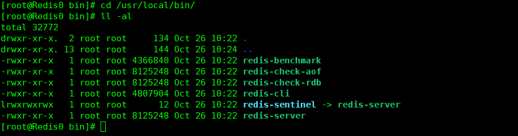

# Redis入门到精通

## Redis简介

REmote DIctionary Server(Redis)是一个由Salvatore Sanfilippo写的key-value存储系统，Redis是一个开源的，使用ANSI C语言编写，遵守BSD协议，支持网络，可基于内存亦可持久化的日志型，Key-Value数据库，并提供了多种语言的API。它被称为数据结构服务器，因为值(value)可用为：字符串(String)，哈希(Map)，列表(list)，集合(sets)和有序集合(sorted sets)等类型.

Redis 是完全开源免费的，遵守BSD协议，是一个高性能的key-value数据库。

Redis 与其他 key - value 缓存产品有以下三个特点：

-   Redis支持数据的持久化，可以将内存中的数据保持在磁盘中，重启的时候可以再次加载进行使用。
-   Redis不仅仅支持简单的key-value类型的数据，同时还提供list，set，zset，hash等数据结构的存储。
-   Redis支持数据的备份，即master-slave模式的数据备份。

## Redis优势

-   性能极高 – Redis能读的速度是110000次/s,写的速度是81000次/s 。
-   丰富的数据类型 – Redis支持二进制案例的 Strings, Lists, Hashes, Sets 及 Ordered Sets 数据类型操作。
-   原子 – Redis的所有操作都是原子性的，同时Redis还支持对几个操作全并后的原子性执行。
-   丰富的特性 – Redis还支持 publish/subscribe, 通知, key 过期等等特性。

## Redis与其他key-value存储有什么不同？

-   Redis有着更为复杂的数据结构并且提供对他们的原子性操作，这是一个不同于其他数据库的进化路径。Redis的数据类型都是基于基本数据结构的同时对程序员透明，无需进行额外的抽象。
-   Redis运行在内存中但是可以持久化到磁盘，所以在对不同数据集进行高速读写时需要权衡内存，应为数据量不能大于硬件内存。在内存数据库方面的另一个优点是， 相比在磁盘上相同的复杂的数据结构，在内存中操作起来非常简单，这样Redis可以做很多内部复杂性很强的事情。 同时，在磁盘格式方面他们是紧凑的以追加的方式产生的，因为他们并不需要进行随机访问。

## Redis安装教程

### Linux下安装Redis

**下载地址：**  http://www.redis.net.cn/download，下载最新稳定版本

1、linux下载redis

```shell
wget http://download.redis.io/releases/redis-5.0.4.tar.gz
```

2、解压安装包

```shell
tar xzf redis-5.0.4.tar.gz -C /指定解压目录
```

3、编译、安装

```shell
# 安装依赖
yum -y install gcc
yum -y install libc

# 进入安装目录
cd redis-5.0.4

# 编译安装
make && make install

# 指定安装目录
make PREFIX=/usr/local/redis install
```

4、 当执行make install之后，在/usr/local/bin下将出现一些redis脚本 



/usr/local/bin为环境变量，其下的脚本可以直接使用，故make进行安装，make install为设置环境变量 

5、拷贝配置文件到/etc

```shell
cp redis.conf /etc/

# 修改配置
# 新建日志地址
mkdir -p /usr/local/redis/logs
touch  /usr/local/redis/logs/redis.log
```

6、修改相关参数

```shell
logfile "/usr/local/redis/logs/redis.log"

## 若使用开机启动，生成pid，该项必须设置为yes，
#否则redis将不能够正常执行开机启动(systemctl start redis,执行后一直卡着，直到超时)
daemonize yes     

##注释掉，允许所有其他ip访问，真实使用最好坐下限制，只允许某些主机访问
#bind 127.0.0.1  

 ## 允许其他机器上的客户端连接当前redis，配置文件设置该项，则开机启动处就可以去掉--protected no 
protected-mode no 

## db保存路径，由于db持久化到磁盘，占用空间可能比较大，所以选择比较打的文件夹设置
dir /usr/local/redis/ 

##设置密码
requirepass 12345  
```

7、设置开机启动

```shell
vim /usr/lib/systemd/system/redis.service

# 添加如下内容
[Unit]
Description=Redis persistent key-value database
After=network.target
After=network-online.target
Wants=network-online.target

[Service]
ExecStart=/usr/local/bin/redis-server /etc/redis.conf --protected-mode no
ExecStop=/usr/local/bin/redis-cli shutdown
#Restart=always
Type=forking
#User=redis
#Group=redis
RuntimeDirectory=redis
RuntimeDirectoryMode=0755

[Install]
WantedBy=multi-user.target
```

Restart取值及含义

```shell
no（默认值）：退出后不会重启
on-success：只有正常退出时（退出状态码为0），才会重启
on-failure：非正常退出时（退出状态码非0），包括被信号终止和超时，才会重启
on-abnormal：只有被信号终止和超时，才会重启
on-abort：只有在收到没有捕捉到的信号终止时，才会重启
on-watchdog：超时退出，才会重启
always：不管是什么退出原因，总是重启
```

Type字段取值及含义 

```shell
simple（默认值）：ExecStart字段启动的进程为主进程
forking：ExecStart字段将以fork()方式启动，此时父进程将会退出，子进程将成为主进程
oneshot：类似于simple，但只执行一次，Systemd 会等它执行完，才启动其他服务
dbus：类似于simple，但会等待 D-Bus 信号后启动
notify：类似于simple，启动结束后会发出通知信号，然后 Systemd 再启动其他服务
idle：类似于simple，但是要等到其他任务都执行完，才会启动该服务。
一种使用场合是为让该服务的输出，不与其他服务的输出相混合
```

8、使配置生效

```shell
systemctl enable redis
systemctl daemon-reload
```

9、启动redis

```python
systemctl start redis
```

10、启动后检查redis启动日志

```shell
vim /usr/local/redis/logs/redis.log
```

```shell
3199:M 25 Mar 2019 09:23:29.873 # WARNING overcommit_memory is set to 0! Background save may fail under low memory condition. To fix this issue add 'vm.overcommit_memory = 1' to /etc/sysctl.conf and then reboot or run the command 'sysctl vm.overcommit_memory=1' for this to take effect.
83199:M 25 Mar 2019 09:23:29.873 # WARNING you have Transparent Huge Pages (THP) support enabled in your kernel. This will create latency and memory usage issues with Redis. To fix this issue run the command 'echo never > /sys/kernel/mm/transparent_hugepage/enabled' as root, and add it to your /etc/rc.local in order to retain the setting after a reboot. Redis must be restarted after THP is disabled.
```

vim /etc/sysctl.conf

```shell
# 添加
vm.overcommit_memory=1
net.core.somaxconn = 1024

# 生效配置
sysctl -p
```

 进制内核中启用Transparent Huge Pages（THP）支持，防止Redis延迟和内存使用问题 

```shell
echo never > /sys/kernel/mm/transparent_hugepage/enabled
```

 将该命令写入/etc/rc.local中，使其重启后也生效 

### Redis配置文件详解

Redis 的配置文件位于 Redis 安装目录下，文件名为 redis.conf。可以通过 **CONFIG** 命令查看或设置配置项

**语法：Redis CONFIG命令格式如下**

```sql
redis 127.0.0.1:6379> CONFIG GET CONFIG_SETTING_NAME
```

**日志等级**

```sql
redis 127.0.0.1:6379> CONFIG GET loglevel
1) "loglevel"
2) "notice"
```

**使用 **\* **号获取所有配置项**

```sql
redis 127.0.0.1:6379> CONFIG GET *
  1) "dbfilename"
  2) "dump.rdb"
  3) "requirepass"
  4) ""
  5) "masterauth"
  6) ""
  7) "unixsocket"
  8) ""
  9) "logfile"
 10) ""
 11) "pidfile"
 12) "/var/run/redis.pid"
 13) "maxmemory"
 14) "0"
 15) "maxmemory-samples"
 16) "3"
 17) "timeout"
 18) "0"
 19) "tcp-keepalive"
 20) "0"
 21) "auto-aof-rewrite-percentage"
 22) "100"
 23) "auto-aof-rewrite-min-size"
 24) "67108864"
 25) "hash-max-ziplist-entries"
 26) "512"
 27) "hash-max-ziplist-value"
 28) "64"
 29) "list-max-ziplist-entries"
 30) "512"
 31) "list-max-ziplist-value"
 32) "64"
 33) "set-max-intset-entries"
 34) "512"
 35) "zset-max-ziplist-entries"
 36) "128"
 37) "zset-max-ziplist-value"
 38) "64"
 39) "hll-sparse-max-bytes"
 40) "3000"
 41) "lua-time-limit"
 42) "5000"
 43) "slowlog-log-slower-than"
 44) "10000"
 45) "latency-monitor-threshold"
 46) "0"
 47) "slowlog-max-len"
 48) "128"
 49) "port"
 50) "6379"
 51) "tcp-backlog"
 52) "511"
 53) "databases"
 54) "16"
 55) "repl-ping-slave-period"
 56) "10"
 57) "repl-timeout"
 58) "60"
 59) "repl-backlog-size"
 60) "1048576"
 61) "repl-backlog-ttl"
 62) "3600"
 63) "maxclients"
 64) "4064"
 65) "watchdog-period"
 66) "0"
 67) "slave-priority"
 68) "100"
 69) "min-slaves-to-write"
 70) "0"
 71) "min-slaves-max-lag"
 72) "10"
 73) "hz"
 74) "10"
 75) "no-appendfsync-on-rewrite"
 76) "no"
 77) "slave-serve-stale-data"
 78) "yes"
 79) "slave-read-only"
 80) "yes"
 81) "stop-writes-on-bgsave-error"
 82) "yes"
 83) "daemonize"
 84) "no"
 85) "rdbcompression"
 86) "yes"
 87) "rdbchecksum"
 88) "yes"
 89) "activerehashing"
 90) "yes"
 91) "repl-disable-tcp-nodelay"
 92) "no"
 93) "aof-rewrite-incremental-fsync"
 94) "yes"
 95) "appendonly"
 96) "no"
 97) "dir"
 98) "/home/deepak/Downloads/redis-2.8.13/src"
 99) "maxmemory-policy"
100) "volatile-lru"
101) "appendfsync"
102) "everysec"
103) "save"
104) "3600 1 300 100 60 10000"
105) "loglevel"
106) "notice"
107) "client-output-buffer-limit"
108) "normal 0 0 0 slave 268435456 67108864 60 pubsub 33554432 8388608 60"
109) "unixsocketperm"
110) "0"
111) "slaveof"
112) ""
113) "notify-keyspace-events"
114) ""
115) "bind"
116) ""
```

**编辑配置： 可以通过修改 redis.conf 文件或使用CONFIG set命令来修改配置 **

CONFIG SET命令基本语法：

```sql
redis 127.0.0.1:6379> CONFIG SET CONFIG_SETTING_NAME NEW_CONFIG_VALUE
```

**案例：**

```sql
redis 127.0.0.1:6379> CONFIG SET loglevel "notice"
OK
redis 127.0.0.1:6379> CONFIG GET loglevel
1) "loglevel"
2) "notice"
```

**参数说明：redis.conf配置项说明如下**

1.Redis默认不是以守护进程的方式运行，可以通过该配置项修改，使用yes启用守护进程

```shell
daemonize no
```

2.当Redis以守护进程方式运行时，Redis默认会把pid写入/var/run/redis.pid文件，可以通过pidfile指定

 ```shell
pidfile /var/run/redis.pid
 ```

3.指定Redis监听端口，默认端口为6379，作者在自己的一篇博文中解释了为什么选用6379作为默认端口，因为6379在手机按键上MERZ对应的号码，而MERZ取自意大利歌女Alessia Merz的名字

```shell
port 6379
```

4.绑定的主机地址

```shell
bind 127.0.0.1
```

5.当客户端闲置多长时间后关闭连接，如果指定为0，表示关闭该功能

 ```shell
timeout 300
 ```

6.指定日志记录级别，Redis总共支持四个级别：debug、verbose、notice、warning，默认为verbose

 ```shell
loglevel verbose
 ```

7.日志记录方式，默认为标准输出，如果配置Redis为守护进程方式运行，而这里又配置为日志记录方式为标准输出，则日志将会发送给/dev/null

 ```shell
logfile stdout
 ```

8.设置数据库的数量，默认数据库为0，可以使用SELECT ``命令在连接上指定数据库id

  ```shell
databases 16
  ```

9.指定在多长时间内，有多少次更新操作，就将数据同步到数据文件，可以多个条件配合

```shell
save `` ``
```

Redis默认配置文件中提供了三个条件：

```shell
save 900 1

save 300 10

save 60 10000
```

分别表示900秒（15分钟）内有1个更改，300秒（5分钟）内有10个更改以及60秒内有10000个更改。

10.指定存储至本地数据库时是否压缩数据，默认为yes，Redis采用LZF压缩，如果为了节省CPU时间，可以关闭该选项，但会导致数据库文件变的巨大

```sql
rdbcompression yes
```

11.指定本地数据库文件名，默认值为dump.rdb

```sql
dbfilename dump.rdb
```

12.指定本地数据库存放目录

 ```sql
dir ./
 ```

13.设置当本机为slav服务时，设置master服务的IP地址及端口，在Redis启动时，它会自动从master进行数据同步

```sql
slaveof `` ``
```

14.当master服务设置了密码保护时，slav服务连接master的密码

```sql
masterauth ``
```

15.设置Redis连接密码，如果配置了连接密码，客户端在连接Redis时需要通过AUTH ``命令提供密码，默认关闭

 ```sql
requirepass foobared
 ```

16.设置同一时间最大客户端连接数，默认无限制，Redis可以同时打开的客户端连接数为Redis进程可以打开的最大文件描述符数，如果设置 maxclients 0，表示不作限制。当客户端连接数到达限制时，Redis会关闭新的连接并向客户端返回max number of clients reached错误信息

 ```sql
maxclients 128
 ```

17.指定Redis最大内存限制，Redis在启动时会把数据加载到内存中，达到最大内存后，Redis会先尝试清除已到期或即将到期的Key，当此方法处理 后，仍然到达最大内存设置，将无法再进行写入操作，但仍然可以进行读取操作。Redis新的vm机制，会把Key存放内存，Value会存放在swap区

```sql
maxmemory
```

18.指定是否在每次更新操作后进行日志记录，Redis在默认情况下是异步的把数据写入磁盘，如果不开启，可能会在断电时导致一段时间内的数据丢失。因为 redis本身同步数据文件是按上面save条件来同步的，所以有的数据会在一段时间内只存在于内存中。默认为no

  ```sql
appendonly no
  ```

19.指定更新日志文件名，默认为appendonly.aof

  ```sql
appendfilename appendonly.aof
  ```

20.指定更新日志条件，共有3个可选值：   **no**：表示等操作系统进行数据缓存同步到磁盘（快）   **always**：表示每次更新操作后手动调用fsync()将数据写到磁盘（慢，安全）   **everysec**：表示每秒同步一次（折衷，默认值）

 ```sql
appendfsync everysec
 ```

21.指定是否启用虚拟内存机制，默认值为no，简单的介绍一下，VM机制将数据分页存放，由Redis将访问量较少的页即冷数据swap到磁盘上，访问多的页面由磁盘自动换出到内存中（在后面的文章我会仔细分析Redis的VM机制）

 ```sql
vm-enabled no
 ```

22.虚拟内存文件路径，默认值为/tmp/redis.swap，不可多个Redis实例共享

   ```sql
vm-swap-file /tmp/redis.swap
   ```

23.将所有大于vm-max-memory的数据存入虚拟内存,无论vm-max-memory设置多小,所有索引数据都是内存存储的(Redis的索引数据 就是keys),也就是说,当vm-max-memory设置为0的时候,其实是所有value都存在于磁盘。默认值为0

```sql
vm-max-memory 0
```

24.Redis swap文件分成了很多的page，一个对象可以保存在多个page上面，但一个page上不能被多个对象共享，vm-page-size是要根据存储的 数据大小来设定的，作者建议如果存储很多小对象，page大小最好设置为32或者64bytes；如果存储很大大对象，则可以使用更大的page，如果不 确定，就使用默认值

   ```sql
vm-page-size 32
   ```

25.设置swap文件中的page数量，由于页表（一种表示页面空闲或使用的bitmap）是在放在内存中的，，在磁盘上每8个pages将消耗1byte的内存。

  ```sql
vm-pages 134217728
  ```

26.设置访问swap文件的线程数,最好不要超过机器的核数,如果设置为0,那么所有对swap文件的操作都是串行的，可能会造成比较长时间的延迟。默认值为4

  ```sql
vm-max-threads 4
  ```

27.设置在向客户端应答时，是否把较小的包合并为一个包发送，默认为开启

```sql
glueoutputbuf yes
```

28.指定在超过一定的数量或者最大的元素超过某一临界值时，采用一种特殊的哈希算法

 ```sql
hash-max-zipmap-entries 64

hash-max-zipmap-value 512
 ```

29.指定是否激活重置哈希，默认为开启（后面在介绍Redis的哈希算法时具体介绍）

 ```sql
activerehashing yes
 ```

30.指定包含其它的配置文件，可以在同一主机上多个Redis实例之间使用同一份配置文件，而同时各个实例又拥有自己的特定配置文件

 ```sql
include /path/to/local.conf
 ```


